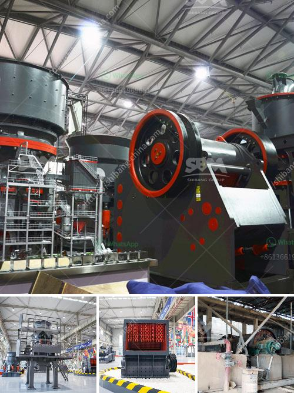

<h3>ميزات كسارة الفك</h3>
تُعتبر كسارة الفك واحدة من أكثر الآلات الثابتة تطورًا في صناعة التعدين ومعالجة المواد. تستخدم على نطاق واسع في تكسير المواد الصلبة والمتوسطة الصلابة كالحجر والصخور والخامات المعدنية والخرسانة المسلحة. وهي تعمل عن طريق توليد ضغط على المواد التي يتم تغذيتها في فتحة التغذية، مما يمكنها من سحقها وتقسيمها إلى قطع صغيرة ومنتظمة.

إن كسارة الفك تتميز بعدة ميزات رئيسية تجعلها هائلة الفائدة والاستخدام، وهنا بعض الميزات البارزة:

1- قدرة التكسير: تتميز كسارة الفك بقدرتها القوية على تكسير المواد وتقسيمها إلى حجم صغير. فهي قادرة على تحطيم المواد الأكبر حجمًا بكفاءة عالية، مما يوفر الوقت والجهد في عمليات التعدين والبناء.

2- توفير الطاقة: تساعد تكنولوجيا التكسير في الكسارة على توفير الطاقة المستخدمة في العملية. حيث تعمل الكسارة بدورة متكاملة تحقق الاستفادة القصوى من الطاقة المستخدمة، وبالتالي تقلل من تكاليف التشغيل.

3- سهولة الصيانة: تم تصميم كسارة الفك بشكل يسهل عملية الصيانة والإصلاح. وتتوفر قطع الغيار بسهولة وبأسعار معقولة، مما يسهل عملية استبدالها عند الضرورة.

4- تشغيل سلس: يتمتع كسارة الفك بتصميم يسهل عملية التشغيل، حيث يتم التحكم فيها بسهولة وتعمل بسلاسة عند تشغيلها. كما أنها تمتاز بتقليل الضوضاء الناجمة عن عملية التكسير، مما يجعلها مناسبة للاستخدام في المناطق السكنية والبيئات الحساسة.

5- مرونة الاستخدام: بفضل تصميمها المتقدم، تستطيع كسارة الفك معالجة مجموعة متنوعة من المواد بفعالية. يمكنها تكسير الحجارة والخرسانة والركام والخامات المختلفة، مما يزيد من إمكانية استخدامها في العديد من التطبيقات في صناعة التعدين والبناء.

في الختام، تعد كسارة الفك أداة عمل مهمة في صناعة التعدين ومعالجة المواد، فهي تتمتع بمزايا عديدة تجعلها فعالة وسريعة في عمليات التكسير وتحقيق الاستفادة القصوى من المواد المعالجة. إن الاستثمار في كسارة الفك يمكن أن يكون خيارًا رائعًا لتحقيق التطور والنجاح في العمليات الصناعية والإنتاجية.
<h3>Contact us</h3><ul><li><strong>Whatsapp:&nbsp;<a href="https://wa.me/8613661969651">+8613661969651</a></strong></li><li><a href="https://swt.shibang-china.com/?git&amp;zhl&amp;ميزات كسارة الفك"><strong>Online Service(chat now)</strong></a></li></ul><h3>Related</h3><ul><li><a href='عملية إنتاج الطين.md'>عملية إنتاج الطين</a></li><li><a href='كم تكلف مصنع التكسير.md'>كم تكلف مصنع التكسير</a></li><li><a href='تقرير مشروع الكسارة 100 tph.md'>تقرير مشروع الكسارة 100 tph</a></li><li><a href='مصنع مسحوق لوح الجبس في إثيوبيا.md'>مصنع مسحوق لوح الجبس في إثيوبيا</a></li><li><a href='مطحنة فحم رولر.md'>مطحنة فحم رولر</a></li></ul>