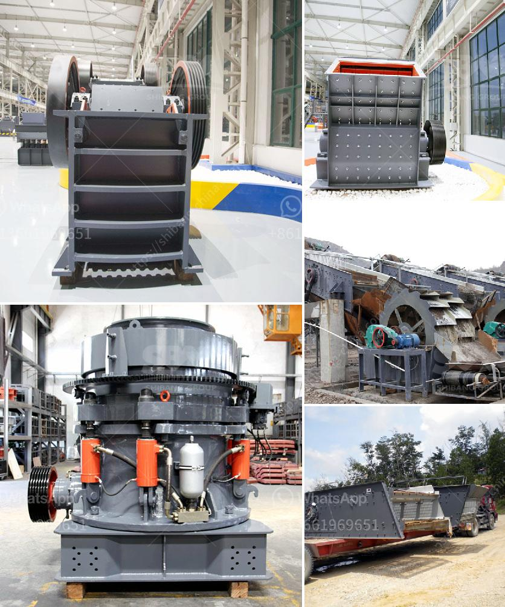

<h3>ناقل البناء للبيع</h3>
إن ناقل البناء هو أداة ضرورية في صناعة البناء. فهو يسهل ويسرع عملية نقل المواد الثقيلة والبناء الثقيلة مثل الأحجار والأسمنت والرمل والحصى. وهو يتكون عادة من سيور ناقلة قابلة للتعديل وجهاز تشغيل يمكن تحريكه عن طريق محرك كهربائي أو محرك ديزل. 

إذا كنت تبحث عن ناقل بناء يتراوح سعره بين 200-400 دولار، ستجد العديد من الخيارات المتاحة في السوق. يمكنك أن تجد ناقلات بناء صغيرة الحجم تناسب استخدامات المشاريع الصغيرة، وهناك أيضًا ناقلات بناء أكبر الحجم تستخدم في المشاريع الكبيرة والمتطلبات الأكبر.

يجب عليك مراعاة عدة عوامل عند شراء ناقل البناء المناسب. أولاً، تأكد من أن الناقل يلبي احتياجاتك ومتطلبات مشروعك. قد تحتاج إلى ناقل قابل للتعديل ليتناسب مع ارتفاع المواد والمسافة التي تحتاج لنقلها. كما يجب النظر في قوة المحرك ومدى تحمله لوزن المواد الثقيلة.

ثانيًا، قم بمراجعة المواصفات والتعليمات المرفقة مع ناقل البناء. يجب أن تتضمن كل تلك المعلومات توضيحًا لكيفية استخدام الجهاز بشكل صحيح وآمن. كما قد تقدم الشركات التصنيعية ضمانات لمدة معينة، لذا تحقق من ذلك قبل الشراء.

ثالثًا، لا تنس البحث بشكل جيد عن الماركات المختلفة والتقييمات المتاحة لها. يمكنك العثور على تقييمات وآراء المستخدمين السابقين عبر الإنترنت، وهذا سيساعدك في اتخاذ القرار الأفضل.

أخيرًا، تأكد من شراء ناقل البناء من مصدر موثوق وموزع معتمد. يمكنك طلب مساعدة مهندس محترف في مجال البناء قبل اتخاذ قرار الشراء للتأكد من أنها تناسب احتياجاتك.

باختيارك الصحيح لناقل البناء، ستتمكن من تحسين كفاءة عملك في صناعة البناء والتقليل من وقت وجهد العمل. كما ستعتبر هذه الأداة استثمارًا جيدًا بالنسبة لك ولمشروعاتك المستقبلية.

باختصار، قبل شراء ناقل البناء، قم بتحديد احتياجاتك، واطّلع على المواصفات والتقييمات، واستشر خبراء البناء، واختر مصدرًا موثوقًا. بذلك، ستتمكن من اختيار ناقل البناء المناسب لك وتحسين عملك في مشاريع البناء المستقبلية.
<h3>Contact us</h3><ul><li><strong>Whatsapp:&nbsp;<a href="https://wa.me/8613661969651">+8613661969651</a></strong></li><li><a href="https://swt.shibang-china.com/?git&amp;zhl&amp;ناقل البناء للبيع"><strong>Online Service(chat now)</strong></a></li></ul><h3>Related</h3><ul><li><a href='آلة سحق الأسفلت بسعة 15 طن في الساعة.md'>آلة سحق الأسفلت بسعة 15 طن في الساعة</a></li><li><a href='آلة كسارة في الفلبين.md'>آلة كسارة في الفلبين</a></li><li><a href='سعر تريتورادورا دي تييرراس في باكستان.md'>سعر تريتورادورا دي تييرراس في باكستان</a></li><li><a href='تخطيط مصنع الأسمنت الصغير بتنسيق PDF.md'>تخطيط مصنع الأسمنت الصغير بتنسيق PDF</a></li><li><a href='مصنع لطحن الحجر الجيري والجبس للإسمنت.md'>مصنع لطحن الحجر الجيري والجبس للإسمنت</a></li></ul>