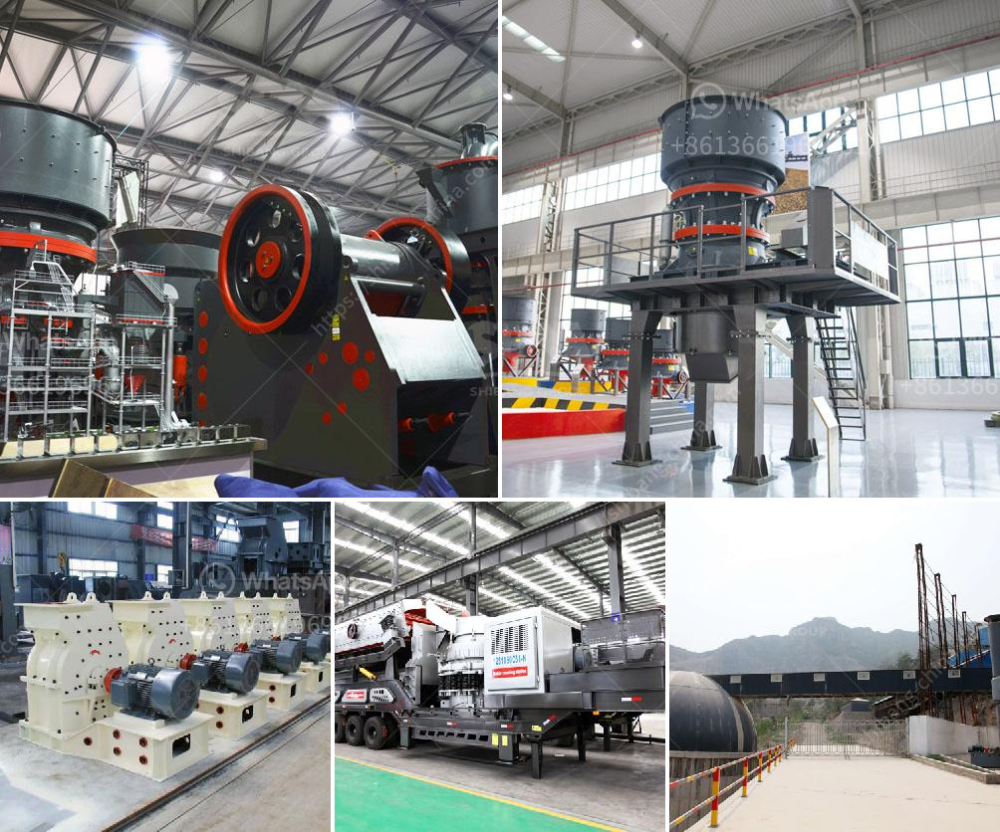

<h3>ناقل حزام لتصميم الفحم في الهند</h3>
يعد ناقل الحزام واحدًا من أهم الوسائل التي تستخدم في عمليات النقل والتوزيع في صناعة التعدين. واحدة من الدول التي تعتمد بشكل كبير على صناعة التعدين لاستخراج الفحم هي الهند. وتمتلك الهند العديد من مناجم الفحم الموزعة في مختلف أنحاء البلاد، وتُعتبر ثاني أكبر منتج للفحم في العالم بعد الصين.

تستخدم الهند تكنولوجيا حديثة لنقل الفحم من وحدات الاستخراج إلى الأماكن المحددة للتصنيع أو للتصدير. ومن بين هذه التكنولوجيات الحديثة تأتي ناقلات الحزام. يعمل ناقل الحزام على نقل الفحم عبر مسافات طويلة بكفاءة عالية وتوفير تكاليف العمالة وزيادة سرعة العمل.

يتكون ناقل الحزام لتصميم الفحم في الهند من حزام مطاطي متصل يقوم بنقل الفحم من نقطة الاستخراج إلى نقطة وجهته. يتم تشغيل الحزام بواسطة بكرات قابلة للدوران يتم تشغيلها بواسطة محرك كهربائي. ويتم توجيه الحزام عبر الأنفاق أو المناطق الجبلية باستخدام أنظمة إرشاد.

يحافظ ناقل الحزام على سلامة التشغيل ويمنع فقدان الفحم بفضل تصميمه المحكم واستخدام الأغراض الحاملة وحواجز الحماية المثبتة على الجانبين. كما يستخدم الحزام في نقل الماء الصخري الزائد لتبريد الفحم والحفاظ على سلامة البيئة.

على الرغم من أن ناقل الحزام يعتبر وسيلة فعالة لنقل الفحم، إلا أنه يتطلب صيانة دورية للحفاظ على أداءه الأمثل. يجب تنظيف الحزام وتفقده بانتظام للتأكد من عدم وجود أي تلف أو تشقق. كما يتم تزييت الصرفيجات والبكرات وفحص الأجزاء الميكانيكية الأخرى بشكل دوري لتجنب أي خلل في الناقل.

يعتبر ناقل الحزام لتصميم الفحم في الهند جزءًا أساسيًا من عمليات التعدين والإنتاج في البلاد. يساهم استخدام هذه التكنولوجيا الحديثة في زيادة كفاءة الإنتاج وتقليل تكاليف التشغيل. وبالتالي، فإن ناقل الحزام يسهم في تحقيق التخطيط الصحيح للتوزيع والنقل والحفاظ على البيئة في صناعة التعدين للفحم في الهند.
<h3>Contact us</h3><ul><li><strong>Whatsapp:&nbsp;<a href="https://wa.me/8613661969651">+8613661969651</a></strong></li><li><a href="https://swt.shibang-china.com/?git&amp;zhl&amp;ناقل حزام لتصميم الفحم في الهند"><strong>Online Service(chat now)</strong></a></li></ul><h3>Related</h3><ul><li><a href='شركة مصنعة مشهورة للكسارة والطاحونة في فرنسا.md'>شركة مصنعة مشهورة للكسارة والطاحونة في فرنسا</a></li><li><a href='كسارات الحجر الرئيسية.md'>كسارات الحجر الرئيسية</a></li><li><a href='مطاحن المطرقة.md'>مطاحن المطرقة</a></li><li><a href='سعر كسارة الفك 400x600.md'>سعر كسارة الفك 400x600</a></li><li><a href='أعمال التعدين والاستغلال في جنوب أفريقيا.md'>أعمال التعدين والاستغلال في جنوب أفريقيا</a></li></ul>