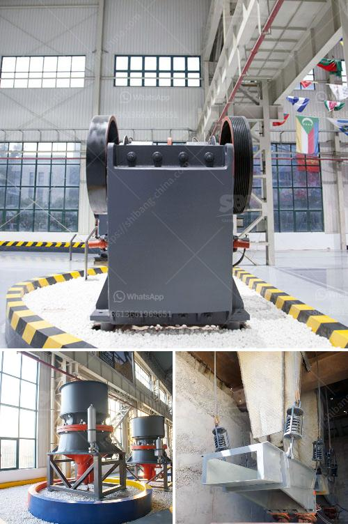

<h3>نظام طحن الحجر الجيري</h3>
تعتبر عملية طحن الحجر الجيري أحد العمليات الهامة في صناعة الأسمنت والكيماويات الزراعية ومعالجة المياه والتعدين. يهدف نظام طحن الحجر الجيري إلى تحويل الحجر الجيري الخام إلى مسحوق دقيق قابل للاستخدام في عمليات الإنتاج المختلفة.

تتألف عملية طحن الحجر الجيري من عدة مراحل. في المرحلة الأولى، يتم سحق الحجر الجيري الخام بواسطة كسارة فكية أو كسارة صدمية إلى قطع صغيرة. ثم يتم نقل هذه القطع إلى مطحنة الأسطوانة أو مطحنة الكرات.

في المرحلة الثانية، تتم عملية طحن الحجر الجيري الخام المسحوق بواسطة المطحنة. تتميز مطاحن الأسطوانة بالقدرة على توفير ضغط مدمج وقوة هائلة لتحقيق تفتيت فعال وطحن الحجر الجيري إلى حجم جسيمات أصغر. من ناحية أخرى، تستخدم مطاحن الكرات كرات فولاذية لطحن الحجر الجيري وتحقيق درجة طحن أكثر دقة.

يعتبر نظام طحن الحجر الجيري حاسمًا لتحقيق جودة المنتج النهائي. فعملية الطحن المناسبة تسمح بتحقيق حجم جسيم أدق، مما يزيد من سطح التفاعل مع المواد الأخرى وبالتالي يزيد من كفاءة الإنتاج. وبفضل تحكم دقيق في عملية الطحن، يمكن تحقيق توزيع حجم جسيم معين لتلبية متطلبات العملاء.

بالإضافة إلى ذلك، يساهم نظام طحن الحجر الجيري في تحسين استدامة العملية الإنتاجية. فإعادة استخدام الحجر الجيري الناتج عن عملية الطحن كمشترك يقلل من النفايات ويقلل من التكاليف. كما يستخدم الحجر الجيري المطحون في التربة الزراعية ومعالجة الماء لتحسين جودته.

باختصار، يعتبر نظام طحن الحجر الجيري أحد العمليات الهامة في صناعات متعددة. يساهم في تحويل الحجر الجيري الخام إلى مسحوق دقيق ويحسن من جودة المنتج النهائي. كما يعتبر الاستفادة من المنتج الناتج واستدامة العملية الإنتاجية أهم مزايا هذا النظام.
<h3>Contact us</h3><ul><li><strong>Whatsapp:&nbsp;<a href="https://wa.me/8613661969651">+8613661969651</a></strong></li><li><a href="https://swt.shibang-china.com/?git&amp;zhl&amp;نظام طحن الحجر الجيري"><strong>Online Service(chat now)</strong></a></li></ul><h3>Related</h3><ul><li><a href='مصانع التعدين في مصر.md'>مصانع التعدين في مصر</a></li><li><a href='كسارة حجر مستعملة للبيع في فلوريدا.md'>كسارة حجر مستعملة للبيع في فلوريدا</a></li><li><a href='آلة سحق نقاء الشورا.md'>آلة سحق نقاء الشورا</a></li><li><a href='شركة تصنيع آلة كسارة الحجر.md'>شركة تصنيع آلة كسارة الحجر</a></li><li><a href='كسارات الحجر في ماليزيا.md'>كسارات الحجر في ماليزيا</a></li></ul>