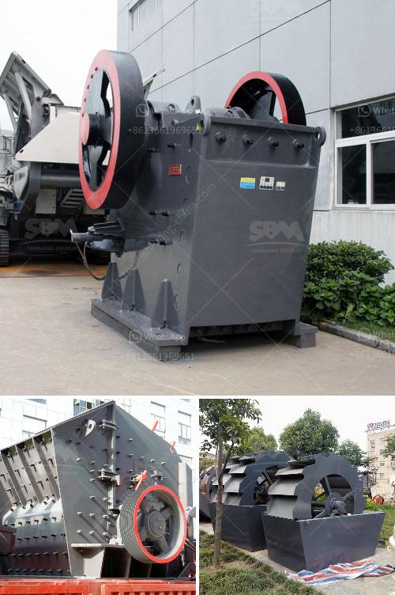

<h3>نظام مصنع البنتونيت</h3>
تعتبر البنتونيت واحدة من المعادن الترابية المهمة جدًا في صناعة العديد من المنتجات. وتستخدم في العديد من التطبيقات مثل الحفر النفطي والتنقية الصناعية والتربة الزراعية وصناعة الورق والتجميل. ولتلبية الطلب المتنامي على البنتونيت، تم تطوير العديد من أنظمة المصانع لإنتاجه.

نظام مصنع البنتونيت يعتمد على مجموعة من الأجهزة والمعدات التي تعمل بشكل متكامل لإنتاج البنتونيت بجودة عالية. يتكون النظام من أجهزة لمعالجة المواد الخام وتنقيتها، وأجهزة للتجفيف والطحن وتصنيف البنتونيت المصنع. كما توجد أيضًا أجهزة لتنقية وتعقيم الماء المستخدم في عملية المصنع.

يبدأ العملية بوضع المواد الخام في جزء خاص من المصنع، حيث يتم تنقيتها وفصلها عن الشوائب والمواد الغير مرغوب فيها. ثم تتم عملية التجفيف بواسطة أجهزة خاصة لإزالة الرطوبة المتبقية، وبعد ذلك يتم طحن البنتونيت المجفف للحصول على حجم الجسيمات المناسب.

عملية التصنيف هي خطوة مهمة لضمان جودة البنتونيت المنتج. يتم استخدام أجهزة خاصة لفصل الجسيمات وتصنيفها وفقًا لحجمها وخواصها الفيزيائية. وتراقب الأجهزة هذه بشكل دقيق ومستمر لضمان استقرار العملية والحد الأدنى من الانتكاسات.

يجب أيضًا أن يكون هناك اهتمام بتنقية وتعقيم الماء المستخدم في مصنع البنتونيت. فمياه الشرب والترطيب المستخدمة يجب أن تخضع لمعالجة فعالة لإزالة الشوائب والمواد الضارة.

باختصار، نظام مصنع البنتونيت يحقق عملية إنتاج مستدامة وعالية الجودة. ويعتمد على مجموعة من الأجهزة والمعدات التي تعمل بشكل متكامل لتلبية الطلب المتزايد على البنتونيت في مختلف الصناعات. يجب أن تتمتع هذه الأجهزة بالقدرة على التحكم الدقيق في العملية وتوفير الجودة المثلى للمنتج النهائي.
<h3>Contact us</h3><ul><li><strong>Whatsapp:&nbsp;<a href="https://wa.me/8613661969651">+8613661969651</a></strong></li><li><a href="https://swt.shibang-china.com/?git&amp;zhl&amp;نظام مصنع البنتونيت"><strong>Online Service(chat now)</strong></a></li></ul><h3>Related</h3><ul><li><a href='كسارة مخروطية hp300.md'>كسارة مخروطية hp300</a></li><li><a href='كسارة الحجر ديربان.md'>كسارة الحجر ديربان</a></li><li><a href='آلات وتجهيزات تسمين الجير.md'>آلات وتجهيزات تسمين الجير</a></li><li><a href='معدات تحسين خامات مختلفة في جميع أنحاء العالم.md'>معدات تحسين خامات مختلفة في جميع أنحاء العالم</a></li><li><a href='معدات غسيل الباريت.md'>معدات غسيل الباريت</a></li></ul>