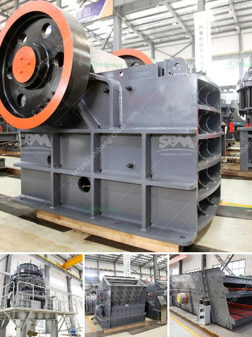

<h3>نماذج كسارات الحجر في ماليزيا</h3>
ماليزيا هي واحدة من الوجهات الشهيرة عالميًا في صناعة الحجر والمحاجر. يوجد العديد من مواقع التعدين في مختلف أنحاء البلاد تعمل على استخراج الحجر الرملي والجرانيت والرخام والبازلت والحجر الجيري وأنواع أخرى مختلفة من الصخور.

تتميز ماليزيا بنماذج متنوعة ومتعددة لكسارات الحجر التي تعتبر مفتاحًا في صناعة التعدين. تشمل هذه الكسارات كافة العمليات اللازمة لكسر الصخور وتحويلها إلى مواد بناء قابلة للاستخدام في البناء والتشييد والصناعات الأخرى.

تتمتع كسارات الحجر في ماليزيا بالعديد من المزايا. أولاً، تتواجد في مواقع استراتيجية بالقرب من المصانع والمشاريع الكبيرة، مما يسهل عملية النقل للمواد. ثانيًا، تشتمل هذه الكسارات على تجهيزات متطورة وآليات حديثة مما يساعد على زيادة الإنتاجية وتقليل التكلفة والاعتماد على اليد العاملة. بالإضافة إلى ذلك، تستخدم بعض الكسارات في ماليزيا أساليب حماية البيئة وإدارة المخلفات بطرق مبتكرة للحد من التأثيرات البيئية السلبية لعمليات التعدين.

يتم استخدام الحجر المكسر في ماليزيا في العديد من الأغراض، منها البناء والتشييد، والطرق والجسور، والمنشآت الصناعية، والبنية التحتية، وصناعة الجلاس، والزراعة، وصناعة السيراميك والزجاج، والعديد من الصناعات الأخرى. يتميز الحجر المكسر في ماليزيا بجودته العالية وملائمته للاستخدامات المختلفة، مما يجعله مفضلًا للمستخدمين المحليين والعالميين.

علاوة على ذلك، تُعَدّ صناعة كسارات الحجر في ماليزيا من الصناعات الرئيسية التي تقدم فرص عمل للكثير من السكان المحليين. توفر هذه الصناعة مصدرًا كبيرًا للعمالة غير المهرة والمهرة على حد سواء، مما يسهم في تحسين الاقتصاد المحلي وخلق فرص عمل جديدة.

وفي الختام، تعتبر كسارات الحجر في ماليزيا من النماذج المميزة في صناعة التعدين. تتميز بتنوعها وجودتها العالية ومزاياها العديدة فيما يتعلق بالموقع والتجهيزات وحماية البيئة والاقتصاد المحلي. تلعب هذه النماذج دورًا هامًا في تلبية احتياجات السوق المحلية والعالمية للحجر المكسر وتلبية متطلبات البناء والتشييد في ماليزيا.
<h3>Contact us</h3><ul><li><strong>Whatsapp:&nbsp;<a href="https://wa.me/8613661969651">+8613661969651</a></strong></li><li><a href="https://swt.shibang-china.com/?git&amp;zhl&amp;نماذج كسارات الحجر في ماليزيا"><strong>Online Service(chat now)</strong></a></li></ul><h3>Related</h3><ul><li><a href='مورد كسارة الأسطوانة المزدوجة.md'>مورد كسارة الأسطوانة المزدوجة</a></li><li><a href='آلة الكالسيوم كاربونات الحجر.md'>آلة الكالسيوم كاربونات الحجر</a></li><li><a href='كيفية سحق خام الذهب في ماين كرافت.md'>كيفية سحق خام الذهب في ماين كرافت</a></li><li><a href='مصنعي مطاحن الفحم في الهند.md'>مصنعي مطاحن الفحم في الهند</a></li><li><a href='كسارة الفحم 10 مم.md'>كسارة الفحم 10 مم</a></li></ul>