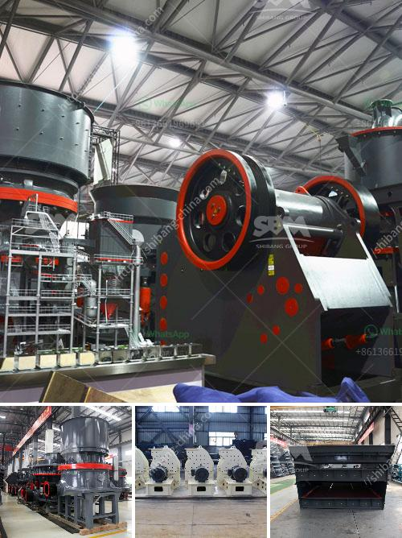

<h3>نموذج عملي لكسارة الحجر</h3>
تعتبر كسارة الحجر جهازًا هامًا في صناعة البناء والتشييد، حيث تقوم بتكسير الصخور الكبيرة إلى قطع أصغر يمكن استخدامها في العديد من التطبيقات. وقد تم تطوير العديد من النماذج العملية لكسارة الحجر لتلبية احتياجات السوق المتغيرة. سنقدم في هذه المقالة نموذجًا عمليًا لكسارة الحجر.

في البداية، يتم تصميم كسارة الحجر لتتوافق مع متطلبات الإنتاج المحددة، مثل الطاقة والإنتاجية وحجم المدخلات والإخراج ومتطلبات تحجيم المنتج النهائي. يتم تحسين التصميم من خلال أخذ هذه المتطلبات في الاعتبار، حيث يتم استخدام أنواع مختلفة من الكسارات، مثل كسارة الفك وكسارة الصدم وكسارة المخروط، وتحديد الشاشات والمناخل المناسبة لفصل الحصى المنتج من الحصى غير المرغوب فيه.

بعد التصميم، يتم تجميع الكسارة وتثبيتها على الأساس المناسب. يتم توصيل المحرك بالكسارة لتشغيلها، وكذلك توصيل نظام الناقل لنقل الحصى بعد التكسير إلى منطقة التخزين أو العملية التالية.

عملية الكسارة تبدأ بتغذية الصخور الكبيرة إلى فوهة التغذية. يتم نقل الصخور إلى مجموعة الكسارة التي يتم تشغيلها بالقوة الميكانيكية لتكسير الصخور إلى حجم أصغر. يتم تنظيف الصخور المكسرة باستخدام الشاشات والمناخل لفصل حصى المنتج من الحصى الزائد.

بعد عملية التكسير، يتم جمع الحصى المنتج في مناطق التخزين المخصصة. هذا الحصى يمكن استخدامه في العديد من التطبيقات، مثل البناء والتشييد وصناعة الخرسانة والأسفلت. تختلف الاحتياجات التسويقية للحصى من سوق إلى آخر، وتتطلب تصنيفًا وفقًا للحجم والجودة والشكل.

يجب الاهتمام بصيانة وتشغيل كسارة الحجر لضمان أداءها الأمثل وتحقيق الإنتاجية المستدامة. يشمل ذلك تنظيف المعدات بانتظام واستبدال الأجزاء التالفة وتزييت المحامل والتحقق من الأسلاك الكهربائية ومراقبة الغبار والضوضاء.

في الختام، يمثل نموذج عملي لكسارة الحجر تكنولوجيا حديثة وموثوقة لتلبية احتياجات صناعة البناء. تساهم هذه الآلة في تحسين الإنتاجية وجودة المنتج وتقليل تكلفة الإنتاج، مما يؤدي إلى تعزيز الاستدامة والربحية في هذه الصناعة المهمة.
<h3>Contact us</h3><ul><li><strong>Whatsapp:&nbsp;<a href="https://wa.me/8613661969651">+8613661969651</a></strong></li><li><a href="https://swt.shibang-china.com/?git&amp;zhl&amp;نموذج عملي لكسارة الحجر"><strong>Online Service(chat now)</strong></a></li></ul><h3>Related</h3><ul><li><a href='سعر كسارة الح.md'>سعر كسارة الح</a></li><li><a href='كسارة الكوارتز السيليكون.md'>كسارة الكوارتز السيليكون</a></li><li><a href='معدات تعدين مستخدمة.md'>معدات تعدين مستخدمة</a></li><li><a href='كسارة الخرسانة المدمجة.md'>كسارة الخرسانة المدمجة</a></li><li><a href='حدود اهتزاز مطحنة الكرة.md'>حدود اهتزاز مطحنة الكرة</a></li></ul>