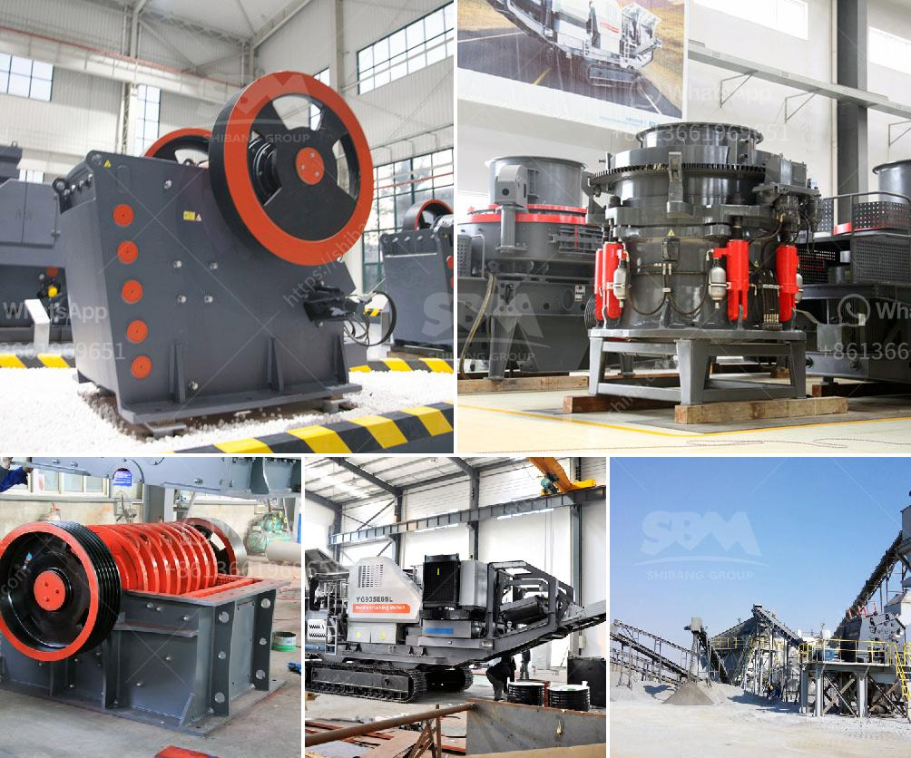

<h3>نموذج لآلة التكسير</h3>
تعد آلة التكسير أحد الأجهزة الهامة في صناعة التعدين والبناء، حيث يستخدم هذا الجهاز لتحطيم المواد الخام بطريقة فعالة وسريعة. واستجابةً لاحتياجات الصناعة، تم تطوير العديد من النماذج لآلة التكسير، ويعتبر النموذج الحديث الذي يتسع لمعالجة المواد بين 200 إلى 400 كلمة أحد أكثر النماذج شيوعًا وفعالية.

نموذج آلة التكسير هذا يتكون من عدة مكونات أساسية. أولاً، يحتوي النموذج على وحدة تغذية تعمل على نقل المواد الخام إلى فم التغذية. يتم تنظيم تدفق المواد بواسطة آلية التحكم، مما يسمح بتدفق سلس ومنتظم للمواد إلى الفك الثابت والفك المتحرك، اللذين يعملان على سحق وطحن المادة الخام.

بعد ذلك، يتم إرسال المواد إلى حجرة التكسير، وهنا يتم تحويل المواد إلى حجم أصغر. تحتوي حجرة التكسير على العديد من الأسنان الدوارة والأثر الأفقي المصممة لمعالجة المواد بشكل فعال. يتم تشكيل المواد المحطمة في حجم محدد عن طريق فتحة التفريغ، حيث تخرج المواد المكسورة من الجهاز.

نموذج آلة التكسير هذا معروف بكفاءته العالية وأدائه الممتاز في عملية التكسير. فهو قادر على معالجة المواد الخام بكميات كبيرة وتحويلها إلى حجم أصغر في وقت قصير. بالإضافة إلى ذلك، يتميز النموذج بتصميمه الخاص الذي يزيد من كفاءة العملية ويقلل من استهلاك الطاقة المطلوبة.

تستخدم آلة التكسير هذه في العديد من الصناعات، مثل صناعة التعدين وإنتاج الركام وتكسير المواد البنائية. تساهم في التسريع وتحسين العمليات الإنتاجية وتقليل التكاليف والوقت المطلوب لتحطيم المواد الخام. بالإضافة إلى ذلك، يعتبر النموذج قابلاً للتكيف والتحسين، حيث يمكن تعديله وفقًا لاحتياجات صناعة التعدين المختلفة.

باختصار، نموذج آلة التكسير بسعة 200-400 كلمة يعتبر جهازًا فعالًا ومهمًا في صناعة التعدين والبناء. يؤدي النموذج وظيفته بكفاءة عالية ويقلل من التكاليف والوقت المطلوب لعملية التكسير. يعد هذا النموذج تحسينًا معترفًا به لآلة التكسير وهو يلبي متطلبات الصناعة الحديثة.
<h3>Contact us</h3><ul><li><strong>Whatsapp:&nbsp;<a href="https://wa.me/8613661969651">+8613661969651</a></strong></li><li><a href="https://swt.shibang-china.com/?git&amp;zhl&amp;نموذج لآلة التكسير"><strong>Online Service(chat now)</strong></a></li></ul><h3>Related</h3><ul><li><a href='كيفية صنع مسحوق الطين الأحمر للغراز.md'>كيفية صنع مسحوق الطين الأحمر للغراز</a></li><li><a href='شركة تصنيع كسارة في جوجارات.md'>شركة تصنيع كسارة في جوجارات</a></li><li><a href='مخططات تدفق لتصنيع الحديد الزهر.md'>مخططات تدفق لتصنيع الحديد الزهر</a></li><li><a href='معدات استخراج الذهب من الصخور.md'>معدات استخراج الذهب من الصخور</a></li><li><a href='كسارة الفك من الصين.md'>كسارة الفك من الصين</a></li></ul>