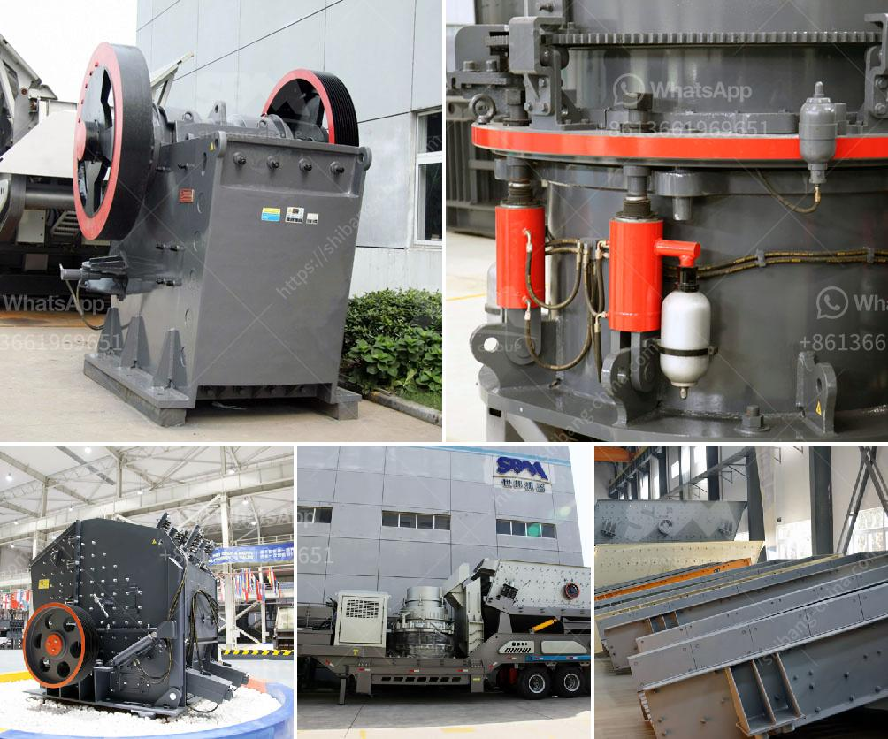

<h3>نوع الفك محطم</h3>
يُعد الفك المحطم (Jaw Crusher) أحد أنواع الكسارات الضخمة المستخدمة في صناعة التعدين والبناء. يعد هذا النوع من الكسارات من أهم الأدوات التي تستخدم لكسر الصخور الصلبة والأحجار الكبيرة إلى قطع صغيرة قابلة للتعامل، وتستخدم على نطاق واسع في صناعات مثل التشييد والبناء والتعدين وتصنيع الرمال.

يتكون الفك المحطم من هيكل أساسي يتضمن إطارًا عموديًا وفكين، حيث يعمل الفكان عند فتح الفاصل بفعل القوة المطبقة عليهما، مما يتيح دخول المواد وكسرها. هناك أيضًا نوعان من الفك المحطم: فك ثابت وفك متحرك. الفك الثابت مثبت على الإطار العلوي للكسارة، بينما يتحرك الفك المتحرك وفقًا للتغيرات في الفضاء بين الفكين.

تتميز الفك المحطم بعدة مزايا. فعلى سبيل المثال، يمكن تعديل حجم الفتحة بين الفكين لتناسب احتياجات المواد المُسحقة، وكذلك ضبط حجم الجسيمات المنتجة. بفضل هذه المزايا، يُعد الفك المحطم ممتازًا للكسارة الابتدائية لتكسير المواد الخام الكبيرة قبل عمليات معالجة إضافية. كما أنه يتمتع بسهولة التشغيل والصيانة، مما يجعله اختيارًا شائعًا لأغراض التعدين.

1. فك محطم مفرد (Single Toggle Jaw Crusher): يتميز بفك واحد متحرك وفك ثابت. يعد هذا النوع مناسبًا للكسارة الابتدائية والثانوية.

2. فك محطم مزدوج (Double Toggle Jaw Crusher): يتميز بفكين متحركين يعملان معًا لكسر المواد الصلبة. يتطلب هذا النوع توجيهًا دقيقًا للحركة.

يجب الإشارة إلى أن اختيار الفك المحطم المناسب يتطلب دراسة العديد من العوامل مثل نوعية المواد المراد كسرها وحجمها الكلي، واحتياجات الإنتاج، والتكلفة وغيرها. ينبغي النظر في الاعتماد على تكنولوجيا وأنواع الفك المحطم القائمة على الاحتياجات المحددة لتحقيق أداء مثلى.

باختصار، يُعتبر الفك المحطم جزءًا أساسيًا في صناعة التعدين والبناء، حيث يقوم بتكسير المواد الصلبة إلى قطع صغيرة. بفضل ميزاته وتنوعه، يعد هذا النوع من الكسارات خيارًا شائعًا لتلبية احتياجات العديد من الصناعات. إن اختيار الفك المحطم المُناسب يلعب دورًا حاسمًا في تحقيق الكفاءة العالية والإنتاجية المثلى.
<h3>Contact us</h3><ul><li><strong>Whatsapp:&nbsp;<a href="https://wa.me/8613661969651">+8613661969651</a></strong></li><li><a href="https://swt.shibang-china.com/?git&amp;zhl&amp;نوع الفك محطم"><strong>Online Service(chat now)</strong></a></li></ul><h3>Related</h3><ul><li><a href='قائمة معدات مصنع الأسمنت.md'>قائمة معدات مصنع الأسمنت</a></li><li><a href='مخطط تدفق عملية استرداد الذهب بتنسيق PDF.md'>مخطط تدفق عملية استرداد الذهب بتنسيق PDF</a></li><li><a href='طاحونة كرات في كينيا.md'>طاحونة كرات في كينيا</a></li><li><a href='مواصفات مطحنة الأسطوانة 3.md'>مواصفات مطحنة الأسطوانة 3</a></li><li><a href='مصنعون لمصانع التكسير المتنقلة.md'>مصنعون لمصانع التكسير المتنقلة</a></li></ul>