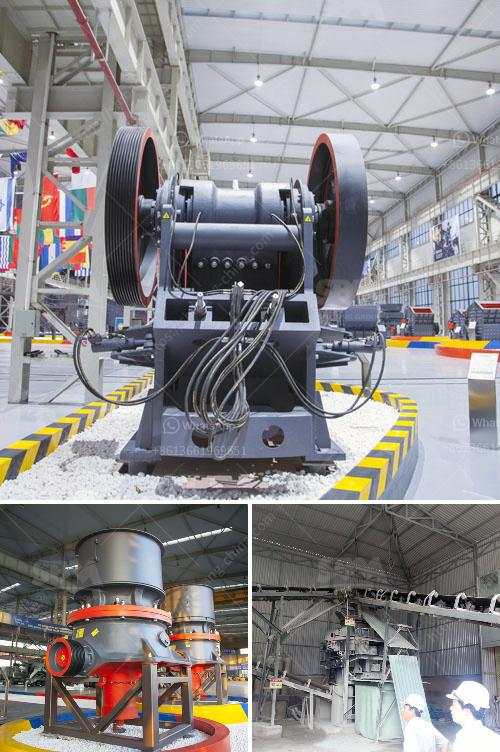

<h3>نوع مطحنة طاحونة عمودية في ماليزيا</h3>
مطحنة طاحونة عمودية هي عبارة عن نوع من المعدات التي تستخدم لطحن المواد الخام في صناعة الأسمنت والمعادن والمواد الكيميائية والخامات الأخرى. تعتبر ماليزيا واحدة من الدول التي تعتمد بشكل كبير على صناعة الأسمنت وتملك عددًا من المطاحن الطاحونة العمودية.

تعمل المطاحن الطاحونة العمودية بنظام يستخدم طاقة الطحن العالية المولدة عن طريق محرك كهربائي. يعمل النظام على سحق المواد الخام في شكل حبيبات صغيرة وتنتج حبيبات الأسمنت المطحونة التي تستخدم في صناعة الخرسانة ومنتجات الأسمنت الأخرى.

إحدى الميزات الرئيسية للمطاحن الطاحونة العمودية هي قدرتها على طحن مواد ذات رطوبة عالية. تمتاز هذه المطاحن بنظام تجفيف فعال يسمح بطحن المواد الخام وإزالة الرطوبة المتبقية فيها. بالإضافة إلى ذلك، تسمح هذه المطاحن بتحقيق درجة عالية من الدقة والتحكم في حجم الجسيمات المطحونة، مما يساعد في تحسين جودة المنتج النهائي.

يتم استخدام المطاحن الطاحونة العمودية في العديد من الصناعات، بما في ذلك صناعة الأسمنت والحجر والكيماويات. تعتبر هذه المطاحن أكثر كفاءة من المطاحن التقليدية التي تستخدم في صناعة الأسمنت وتساهم في توفير الطاقة وتقليل تكاليف الإنتاج. كما تعتبر صيانة المطاحن الطاحونة العمودية أسهل بالمقارنة مع الأنواع الأخرى من المطاحن، مما يجعلها خيارًا شائعًا في الصناعة.

في الختام، تلعب المطاحن الطاحونة العمودية دورًا حاسمًا في صناعة الأسمنت والمعادن في ماليزيا وفي العديد من الدول الأخرى. تمتاز هذه المطاحن بكفاءتها وتحكمها في الحجم والجودة، مما يساهم في تحسين عمليات الإنتاج وتحقيق نتائج عالية الجودة.
<h3>Contact us</h3><ul><li><strong>Whatsapp:&nbsp;<a href="https://wa.me/8613661969651">+8613661969651</a></strong></li><li><a href="https://swt.shibang-china.com/?git&amp;zhl&amp;نوع مطحنة طاحونة عمودية في ماليزيا"><strong>Online Service(chat now)</strong></a></li></ul><h3>Related</h3><ul><li><a href='تأجير سيارات الكسارة في كالتيم.md'>تأجير سيارات الكسارة في كالتيم</a></li><li><a href='مصنع صنع مسحوق الجبس.md'>مصنع صنع مسحوق الجبس</a></li><li><a href='سعر كسارة الحجر في باكستان.md'>سعر كسارة الحجر في باكستان</a></li><li><a href='آلة كسارة صغيرة للبيع في زيمبابوي.md'>آلة كسارة صغيرة للبيع في زيمبابوي</a></li><li><a href='كسارة صخور محمولة للذهب.md'>كسارة صخور محمولة للذهب</a></li></ul>