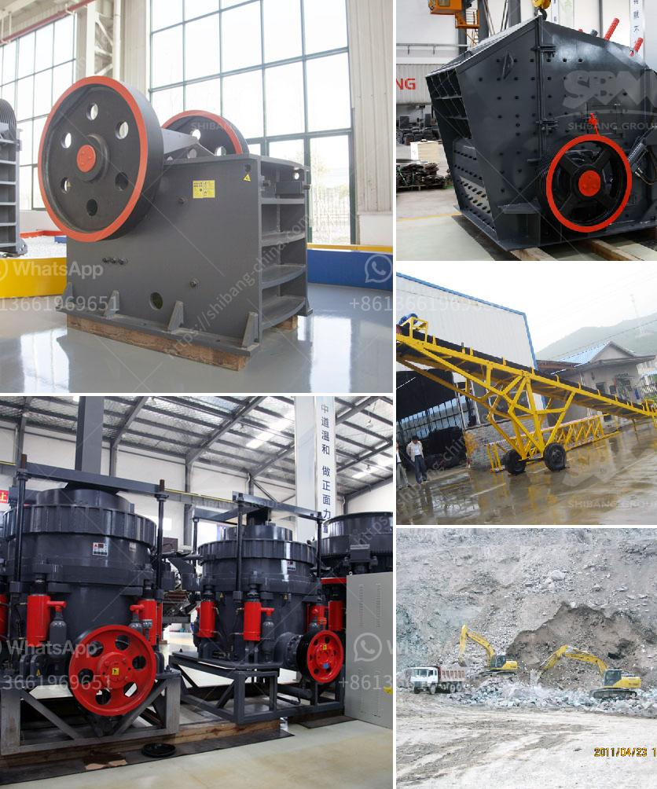

<h3>نوع من مطحنة الكرة</h3>
مطحنة الكرة (Ball Mill) هي أداة تستخدم لطحن وتحطيم المواد الصلبة، وتستخدم على نطاق واسع في الصناعات الكيميائية وصناعة البناء وصناعة الإسمنت وصناعة السيراميك وغيرها. تعد مطحنة الكرة أحد أنواع المطاحن الأكثر شيوعًا وشهرة لدى المصانع والشركات حول العالم.

تتكون مطحنة الكرة من جسم أسطواني معبأ بالكرويات المعدنية، وغالبًا ما يكون الجسم مصنوعًا من الفولاذ ومبطنًا بمادة تسمى السيراميك للحد من التأثير الكيميائي. يدور الجسم على محوره الطولي ويتم ملء ثلث المطحنة تقريبًا بالمواد التي تحتاج إلى طحنها. وعندما يدور الجسم، تتحرك الكرويات المعدنية داخل المطحنة وتسحق المواد الصلبة.

تستخدم مطاحن الكرة للطحن الجاف والطحن الرطب. في الطحن الجاف، يتم إضافة المواد الخام والكرويات المعدنية إلى المطحنة ويتم تطحينها حتى يتم الحصول على الحجم المطلوب للمواد. أما في الطحن الرطب، يتم إضافة سائل (مثل الماء أو الزيت) إلى المطحنة ليتم تحويل المواد إلى معجون قابل للتشكيل.

تتميز مطاحن الكرة بعدة مزايا. أولاً، فهي فعالة في طحن المواد الصلبة المختلفة وتحويلها إلى حجم جزيء صغير. ثانيًا، توفر مرونة كبيرة في استخدامها حيث يمكن ضبط سرعة الدوران وزمن الطحن وحجم الكرويات لتحقيق النتائج المطلوبة. ثالثًا، فهي سهلة التشغيل والصيانة، ولا تتطلب مهارات معقدة لتشغيلها. رابعًا، فهي تعمل بكفاءة عالية وتوفر إنتاجًا أكبر في وقت أقل.

في الختام، تعد مطاحن الكرة أحد أدوات الطحن الأساسية التي تستخدم في الصناعات المختلفة. تتيح للمصانع والشركات خفض حجم المواد الصلبة وتحويلها إلى شكل يسهل معالجته وتشكيله. قوة وفعالية هذا النوع من المطاحن يجعلها اختيار مثالي للعديد من الصناعات التي تعتمد على عملية الطحن في عملياتها التصنيعية.
<h3>Contact us</h3><ul><li><strong>Whatsapp:&nbsp;<a href="https://wa.me/8613661969651">+8613661969651</a></strong></li><li><a href="https://swt.shibang-china.com/?git&amp;zhl&amp;نوع من مطحنة الكرة"><strong>Online Service(chat now)</strong></a></li></ul><h3>Related</h3><ul><li><a href='كسارات مستعملة في نيجيريا.md'>كسارات مستعملة في نيجيريا</a></li><li><a href='مصنع كرة الاسمنت المواد والطاقة.md'>مصنع كرة الاسمنت المواد والطاقة</a></li><li><a href='وكيل وارد ريموند مطحنة إندونيسيا.md'>وكيل وارد ريموند مطحنة إندونيسيا</a></li><li><a href='أهداف مطحنة الكرة.md'>أهداف مطحنة الكرة</a></li><li><a href='نظام مصنع البنتونيت.md'>نظام مصنع البنتونيت</a></li></ul>