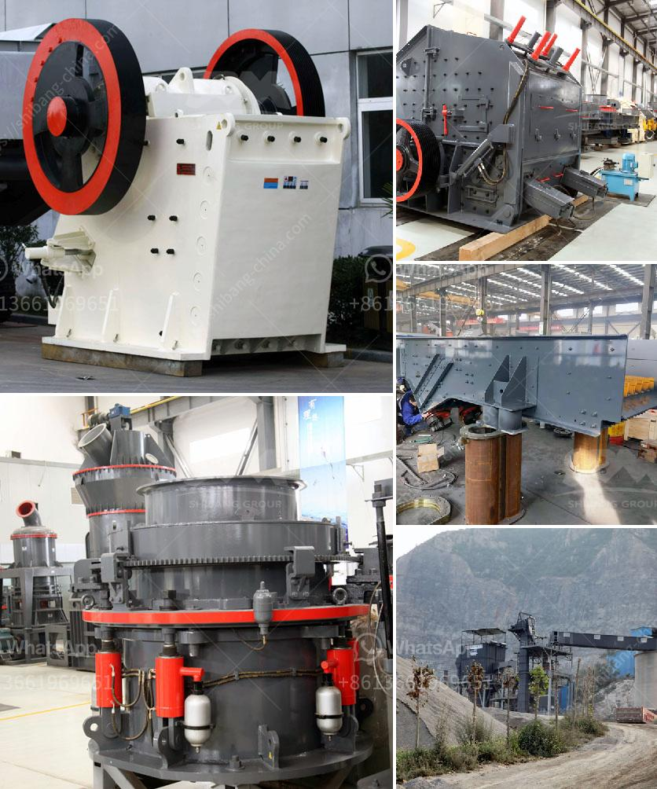

<h3>هل هناك طاحونة فائقة الدقة عمودية للأسطوانة</h3>
تعتبر طاحونة فائقة الدقة عمودية للأسطوانة من اهم الآلات في صناعة المعادن والتصنيع، حيث تستخدم في عمليات طحن المعادن والمواد الصلبة الأخرى للحصول على سطح نهائي دقيق وعالي الجودة. تتميز هذه الطواحين بسطح أفقي للطحن وعامودي للأسطوانة، مما يتيح لها القدرة على عمل دقيق وفعال في إنتاج القطع والأجزاء المعدنية.

تتوفر طواحين الأسطوانة العمودية بتشكيلات عديدة، وتختلف في حجمها وتصاميمها ومميزاتها. يتم استخدام هذه الطواحين في العديد من الصناعات مثل السيارات والطيران والصناعات البحرية والطبية وغيرها. وتعتبر العديد من الشركات المصنعة للمعدات الصناعية تطور وتصنيع طواحين أسطوانية عمودية عالية الجودة.

وتشتمل طواحين الأسطوانة العمودية على عدة أجزاء رئيسية تشمل السطح العلوي للطحن والجدول الدوار والعمود العامودي. تتحكم هذه الطواحين في عملية الطحن للمادة المراد طحنها بطريقة دقيقة وفعالة، وتعمل على توفير سطح مستو ودقيق بنسبة عالية.

وتعتبر الطواحين العمودية فائقة الدقة أكثر كفاءة من الطواحين الأخرى مثل الطواحين الأفقية التقليدية، حيث تتمتع بقدرة أعلى على التحمل والدقة والأداء العالي. وتعتبر هذه الطواحين مثالية لعمليات الطحن المتخصصة وتحتاج إلى دقة فائقة وجودة عالية في النتائج.

وتُستخدم طواحين الأسطوانة العمودية في العديد من التطبيقات مثل طحن الصلب، والألمنيوم، والنحاس، ومعادن أخرى، وتستخدم أيضًا في عمليات طحن المواد غير المعدنية مثل الزجاج والسيراميك. كما يمكن استخدامها في عمليات التشكيل والطحن العمودية، وتظهر كفاءة مثلى في توفير النتائج عالية الجودة والدقة العالية في الأشكال والأبعاد.

وباختصار، فإن طواحين الأسطوانة العمودية فائقة الدقة تمثل حلاً مهماً في صناعة التصنيع وطحن المعادن والمواد الأخرى، حيث تتميز بدقة وكفاءة عالية، مما يسهم في تقديم منتجات نهائية عالية الجودة وتلبية احتياجات العملاء المختلفة. وتعتبر هذه الطواحين أداة ضرورية في الصناعات التي تحتاج إلى طحن وتشكيل دقيق وفعال للمعادن والمواد الأخرى، وتعزز جودة ودقة التصنيع النهائي.
<h3>Contact us</h3><ul><li><strong>Whatsapp:&nbsp;<a href="https://wa.me/8613661969651">+8613661969651</a></strong></li><li><a href="https://swt.shibang-china.com/?git&amp;zhl&amp;هل هناك طاحونة فائقة الدقة عمودية للأسطوانة"><strong>Online Service(chat now)</strong></a></li></ul><h3>Related</h3><ul><li><a href='عملية تعدين الكوارتز في ولاية أندرا براديش.md'>عملية تعدين الكوارتز في ولاية أندرا براديش</a></li><li><a href='طحن الفلدسبار للغراز.md'>طحن الفلدسبار للغراز</a></li><li><a href='آلة تكسير الحجر في الصين.md'>آلة تكسير الحجر في الصين</a></li><li><a href='كسارات البلارست في Alibaba.md'>كسارات البلارست في Alibaba</a></li><li><a href='مصنع تكسير الجرانيت 200 طن في الساعة للبيع.md'>مصنع تكسير الجرانيت 200 طن في الساعة للبيع</a></li></ul>