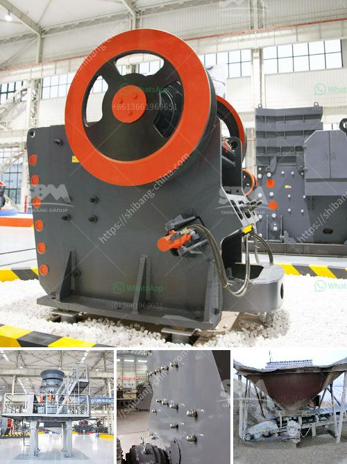

<h3>وحدة إنتاج مطحنة الرمل في كيرالا</h3>
تعتبر مطحنة الرمل واحدة من الوحدات الإنتاجية المهمة في ولاية كيرالا في جنوب الهند. تقع هذه الوحدة في موقع استراتيجي يسمح لها بالحصول على مواد خام ذات جودة عالية وسهولة الوصول إليها.

تعدُّ مطحنة الرمل وحدة إنتاجية تستخدم لغرض إنتاج الرمل الناعم من الصخور والحصى المعدنية الخشنة. يتم استخدام الرمل الناعم في صناعة الخرسانة والطوب والزجاج والأسمنت وعديد من المنتجات الأخرى. لذا، يعتبر هذا المصنع من الأماكن الرئيسية في عملية الإنتاج.

تتركز فائدة وحدة الإنتاج هذه في استخدام التكنولوجيا المتقدمة والماكينات الحديثة. يمكن أن تتضمن هذه الماكينات الكسارات والغرابيل والناقلات. تعمل هذه الماكينات بتقنيات عالية تضمن جودة المنتج النهائي والكفاءة في الإنتاج.

عملية إنتاج الرمل تبدأ عادةً بسحق الصخور الخشنة بواسطة الكسارات القوية. يتم عادةً حمل الصخور الخشنة من المحاجر إلى المطحنة بواسطة الناقلات. في المطحنة، تمر الصخور الخشنة عبر الغرابيل الخاصة التي تفرز الحجارة ذات الأحجام المختلفة. يتم توجيه الحصى والصخور الكبيرة إلى مكان التخزين الخارجي للاستفادة منها في المستقبل.

بعد فحص الحصى، يتم توجيه الحجارة الصغيرة إلى الماكينات الأخرى للتحضير لعملية طحن الرمل. يتم طحن الحبوب الرملية لتكون ذات حجم ناعم وموحد. يتم أخيرًا تغليف وتعبئة الرمل الناعم في أكياس جاهزة للبيع في السوق.

تساهم مطحنة الرمل في توفير فرص عمل للعديد من الأشخاص في المنطقة. توفر الوحدة فرص عمل مباشرة وغير مباشرة للعمال المهرة وغير المهرة في المنطقة. بالإضافة إلى ذلك، تساعد عملية الإنتاج على تعزيز الاقتصاد المحلي وزيادة الإيرادات المحلية من خلال بيع المنتج النهائي.

لخلاصة القول، تعد مطحنة الرمل في ولاية كيرالا واحدة من الوحدات الإنتاجية الهامة في المنطقة. تعمل بتقنيات حديثة لضمان جودة وكفاءة الإنتاج. تسهم هذه الوحدة في توفير فرص عمل وتعزيز الاقتصاد المحلي. من خلال إنتاجها للرمل الناعم، تلعب دورًا حيويًا في دعم العديد من الصناعات المختلفة وتلبية احتياجات السوق المحلية والعالمية.
<h3>Contact us</h3><ul><li><strong>Whatsapp:&nbsp;<a href="https://wa.me/8613661969651">+8613661969651</a></strong></li><li><a href="https://swt.shibang-china.com/?git&amp;zhl&amp;وحدة إنتاج مطحنة الرمل في كيرالا"><strong>Online Service(chat now)</strong></a></li></ul><h3>Related</h3><ul><li><a href='تصميم مصانع التكسير الصناعية.md'>تصميم مصانع التكسير الصناعية</a></li><li><a href='مطاحن للبيع في هراري.md'>مطاحن للبيع في هراري</a></li><li><a href='كم من الأرض مطلوبة لكسارة الحجر.md'>كم من الأرض مطلوبة لكسارة الحجر</a></li><li><a href='عملية الكرة الطحن.md'>عملية الكرة الطحن</a></li><li><a href='آلة طحن صناعية في نيجيريا.md'>آلة طحن صناعية في نيجيريا</a></li></ul>