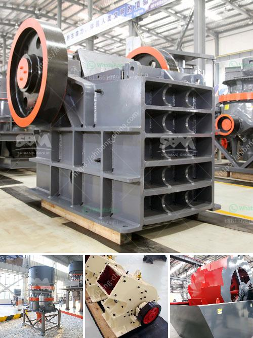

<h3>وحدة تكسير الحجر الكوارتز في الهند</h3>
تعتبر الهند واحدة من الدول الرئيسية في صناعة التعدين والتكسير، حيث توجد العديد من الوحدات والمصانع المتخصصة في تكسير الحجر الكوارتز. الكوارتز هو نوع من المعادن الطبيعية المتوفرة في جميع أنحاء العالم، وتعتبر منتجاتها قيمة عالية في العديد من الصناعات، مثل الصناعة الزجاجية والسيراميك والمجوهرات.

وحدات تكسير الحجر الكوارتز في الهند تتميز بتكنولوجيا حديثة وتجهيزات متطورة. تعمل هذه الوحدات على تكسير الحجر الكوارتز إلى قطع صغيرة أو مسحوق دقيق يمكن استخدامه في العديد من التطبيقات المختلفة. يتم استخدامها في صناعة الزجاج لإنتاج زجاج شفاف ونقي، كما يتم استخدامها في صنع السيراميك لإضفاء خصائص فريدة مثل المتانة والمقاومة للحرارة.

الحجر الكوارتز النقي يتم استخدامه في صناعة الإلكترونيات والمعدات الطبية. يتم تحويل الكوارتز إلى شرائح دقيقة تستخدم في صناعة الميكروشريحات والأجهزة الإلكترونية الأخرى. يعمل الكوارتز كموصل حراري فعال ويمتاز بالاحتفاظ بالحرارة لفترة طويلة، مما يجعله مناسبًا للاستخدام في مجالات مثل تبريد الكمبيوتر وتقنيات التبريد الأخرى.

وحدات تكسير الكوارتز في الهند لديها قدرة كبيرة على إنتاج الكوارتز المكسور عالي الجودة وبأحجام مختلفة. تعمل هذه الوحدات بناءً على تقنيات التكسير المتقدمة والمعدات الحديثة، مما يضمن منتجًا نهائيًا بجودة ممتازة ومواصفات دقيقة.

تعمل الوحدات أيضًا على مراعاة الاستدامة البيئية في عملياتها. يتم استخدام تقنيات متقدمة للتحكم في الغبار والأتربة والضوضاء التي تصاحب عمليات التكسير. تعتبر الاستدامة والحفاظ على البيئة جزءًا هامًا من ممارسات الصناعة في الهند، وتعزز هذه الوحدات الالتزام بتقديم منتجات عالية الجودة بطرق صديقة للبيئة.

يجب الإشارة إلى أن وحدات تكسير الحجر الكوارتز في الهند تواجه تحديات مثل الزيادة في تكاليف الطاقة والموارد الطبيعية. ومع ذلك، فإن تركيز هذه الوحدات على الجودة والابتكار يجعلها تتحدى هذه التحديات وتحقق النجاح في السوق المحلية والعالمية.

باختصار، تعد وحدات تكسير الحجر الكوارتز في الهند أحد القطاعات الرئيسية في صناعة التكسير والتعدين. تقدم هذه الوحدات منتجات عالية الجودة ومتنوعة من الكوارتز المكسور، وتلتزم بممارسات صديقة للبيئة. تلعب صناعة تكسير الحجر الكوارتز في الهند دورًا هامًا في تلبية احتياجات الصناعات في الهند وخارجها.
<h3>Contact us</h3><ul><li><strong>Whatsapp:&nbsp;<a href="https://wa.me/8613661969651">+8613661969651</a></strong></li><li><a href="https://swt.shibang-china.com/?git&amp;zhl&amp;وحدة تكسير الحجر الكوارتز في الهند"><strong>Online Service(chat now)</strong></a></li></ul><h3>Related</h3><ul><li><a href='تركيب مصنع صنع الرمل الاصطناعي.md'>تركيب مصنع صنع الرمل الاصطناعي</a></li><li><a href='تعدين الجبس والكروم والحجر الجيري.md'>تعدين الجبس والكروم والحجر الجيري</a></li><li><a href='كسارة الرخام إيطاليا.md'>كسارة الرخام إيطاليا</a></li><li><a href='عملية تصنيع لوح الجبس.md'>عملية تصنيع لوح الجبس</a></li><li><a href='معدات معالجة خام الحديد.md'>معدات معالجة خام الحديد</a></li></ul>