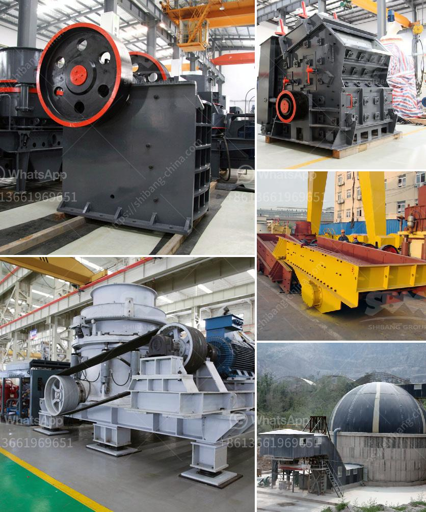

<h3>وحدة طحن الصين</h3>
تعتبر وحدة طحن الصين واحدة من أهم الوحدات الصناعية في الصين وفي العالم أجمع. تتخصص هذه الوحدات في طحن المواد الخام المستخدمة في صناعة الأسمنت والمواد الأخرى ذات الصلة.

تعتبر الصين واحدة من أكبر المنتجين للإسمنت في العالم، وتمتلك العديد من وحدات طحن الصين الضخمة. تتميز هذه الوحدات بتقنيات فريدة وآليات حديثة تضمن جودة عالية في الإنتاج وفي نفس الوقت تحافظ على البيئة.

تعتمد وحدة طحن الصين على عملية طحن الخام، حيث يتم إدخال المواد الخام إلى الوحدة ومن ثم يتم طحنها بواسطة الكرات الصلبة في طواحين الكرة الكبيرة. يتم تحويل المواد الخام المطحونة إلى مسحوق ناعم يطلق عليه الاسم "الخلطة الخام"، والتي تستخدم في مرحلة التصنيع اللاحقة.

تتميز وحدات طحن الصين بأنها قادرة على طحن مختلف أنواع المواد الخام مثل الكلنكر (المواد الأساسية في صناعة الأسمنت) والأضافات الأخرى مثل الجير، الفلدسبار، السيليكا، والبوزولانا. تُعدّ عملية طحن المواد الخام هامة جداً للحصول على خليط متجانس ومتكامل قبل أن تتم عملية التسخين في الأفران.

يعتبر قطاع وحدات طحن الصين صعباً ومنافسًا في نفس الوقت. فعلى الرغم من الإمكانيات والتكنولوجيا المتطورة المتوفرة في الصين، إلا أنه يوجد منافسة شديدة بين الشركات العاملة في هذا القطاع. وتتطلب هذه الشركات ضمان الجودة ودراسة السوق بعناية للحفاظ على تنافسيتها.

بالإضافة إلى ذلك، توجد أيضاً مشكلة بيئية تواجه وحدات طحن الصين. فالعملية الكاملة للطحن تستهلك الكثير من الطاقة وتنتج العديد من الانبعاثات الصناعية التي تلوث الهواء والماء. لذا، يجب على الشركات الاهتمام بتنفيذ إجراءات وقائية للحد من التلوث وتحسين استدامة عمليات الطحن.

وفي الختام، تعتبر وحدة طحن الصين أحد أهم أعمدة صناعة الإسمنت. يتمثل أهمية هذه الوحدة في تلبية احتياجات السوق المحلية والعالمية من الأسمنت عبر ضمان جودة المنتج وتحقيق التنمية المستدامة. وبفضل التقنيات المتطورة والاستراتيجيات المستدامة، يمكن لوحدات طحن الصين أن تستمر في النمو والتطور في المستقبل.
<h3>Contact us</h3><ul><li><strong>Whatsapp:&nbsp;<a href="https://wa.me/8613661969651">+8613661969651</a></strong></li><li><a href="https://swt.shibang-china.com/?git&amp;zhl&amp;وحدة طحن الصين"><strong>Online Service(chat now)</strong></a></li></ul><h3>Related</h3><ul><li><a href='مصنع سحق صغير بسعة 5 طن في الساعة.md'>مصنع سحق صغير بسعة 5 طن في الساعة</a></li><li><a href='سعر مصنع كسارة الحجر.md'>سعر مصنع كسارة الحجر</a></li><li><a href='كسارات Canica 1200 VSI المستعملة.md'>كسارات Canica 1200 VSI المستعملة</a></li><li><a href='مطحنة أسطوانية عمودية للفحم.md'>مطحنة أسطوانية عمودية للفحم</a></li><li><a href='آلة صنع الرمل في جنوب أفريقيا.md'>آلة صنع الرمل في جنوب أفريقيا</a></li></ul>