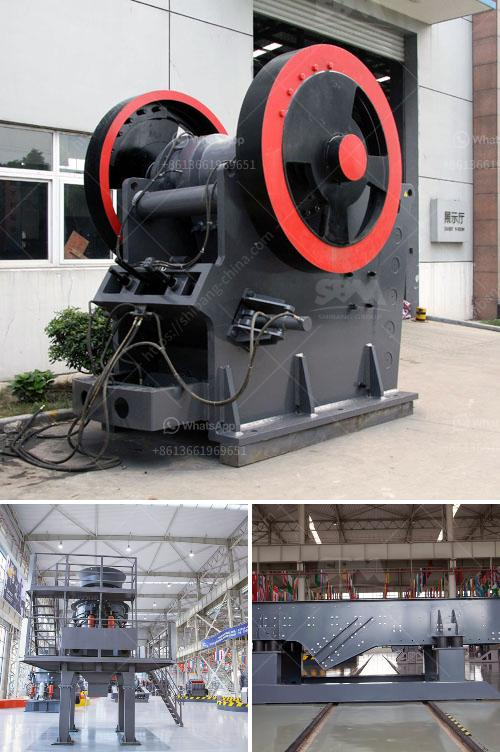

<h3>وحدة طحن الكلنكر الأسمنتي</h3>
تعتبر وحدة طحن الكلنكر الأسمنتي إحدى المكونات الرئيسية في صناعة الأسمنت. وهي عبارة عن مصنع يقوم بطحن الكلنكر الأسمنتي الخام للحصول على مسحوق الأسمنت النهائي الذي يستخدم في إنتاج الخرسانة والبناء.

تأتي الوحدة أحيانًا بشكل مستقل كوحدة منفصلة عن المصانع الكبيرة للأسمنت، وتستخدم قائمة بذاتها لإنتاج الأسمنت. وغالبًا ما تقع الوحدة بالقرب من مناطق تواجد مصانع الأسمنت الرئيسية لتوفير وسائل النقل الفعالة.

تعمل الوحدة على سحق وطحن الكلنكر الأسمنتي الخام المستخرج من المحاجر إلى جزيئات دقيقة تتراوح في الحجم من 1 إلى 20 ميكرومتر. يتم ذلك باستخدام ماكينات الطحن الخاصة التي تستخدم قضبان الصلب أو الكرات المعدنية لطحن وسحق الكلنكر. يتم تغذية الكلنكر الخام والمواد الخام الأخرى إلى مطحنة الأسمنت القائمة في الوحدة وتخلط معًا للحصول على تركيبة مثالية قبل عملية الطحن.

تتم عملية الطحن في وحدة الطحن بواسطة تدوير المطحنة الدوارة بسرعة عالية، مما يؤدي إلى تفتيت الكلنكر وتحويله إلى مسحوق ناعم جدًا. ثم يتم نقل المسحوق الناتج من عملية الطحن إلى مصافي الأسمنت الذي يقوم بفصل الجزيئات حسب الحجم والتخلص من الشوائب والغازات الناتجة عن الطحن.

يعتبر مسحوق الأسمنت النهائي الذي يتم الحصول عليه في وحدة الطحن مناسبًا للاستخدام في إنتاج الخرسانة وغيرها من تطبيقات البناء. وتتنوع مواد الأسمنت المنتجة وفقًا للتركيبة والمواصفات المطلوبة واحتياجات العملاء.

في النهاية، تعد وحدة طحن الكلنكر الأسمنتي جزءًا هامًا في سلسلة إنتاج الأسمنت، حيث يتم من خلالها استخلاص الأسمنت النهائي الذي يحقق الجودة العالية والمواصفات المطلوبة لتنفيذ العديد من المشاريع الهندسية والإنشائية. يضمن استخدام تقنيات حديثة في تصميم وحدات الطحن فعالية عملية الإنتاج، وتحقق الاستدامة البيئية وتقليل التأثير البيئي لصناعة الأسمنت.
<h3>Contact us</h3><ul><li><strong>Whatsapp:&nbsp;<a href="https://wa.me/8613661969651">+8613661969651</a></strong></li><li><a href="https://swt.shibang-china.com/?git&amp;zhl&amp;وحدة طحن الكلنكر الأسمنتي"><strong>Online Service(chat now)</strong></a></li></ul><h3>Related</h3><ul><li><a href='مصنع دوامة للبيع لخام الكروم.md'>مصنع دوامة للبيع لخام الكروم</a></li><li><a href='تقرير جدوى المشروع حول كسارة الحجر.md'>تقرير جدوى المشروع حول كسارة الحجر</a></li><li><a href='مطحنة عمودية للكالسيوم.md'>مطحنة عمودية للكالسيوم</a></li><li><a href='مصنع تكسير الحصى بمقياس كبير.md'>مصنع تكسير الحصى بمقياس كبير</a></li><li><a href='تكلفة كسارة الحصى.md'>تكلفة كسارة الحصى</a></li></ul>