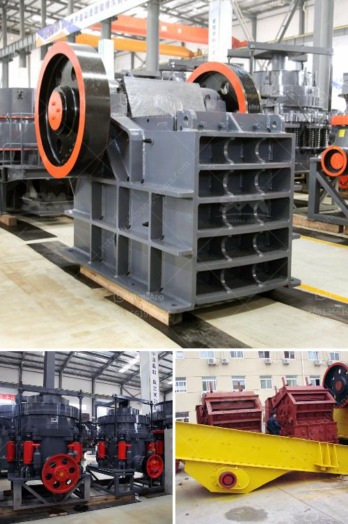

<h3>وحدة معالجة الحجر الجيري بالمنغنيز</h3>
وحدة معالجة الحجر الجيري بالمنغنيز هي عملية تستخدم لاستخلاص المنغنيز من الحجر الجيري. يتم اتباع عدة خطوات في هذه العملية لضمان استخلاص المنغنيز بفعالية وجودة عالية.

أولاً وقبل البدء في عملية معالجة الحجر الجيري بالمنغنيز، يجب إجراء العديد من التحاليل الكيميائية للحجر الأساسي لتحديد نسبة المنغنيز الموجود فيه. وعلى أساس هذه التحليلات، يتم تحديد وترتيب عملية الاستخلاص المثلى وتقدير الاتجاهات العامة لهذه العملية.

ثانياً، تتضمن عملية معالجة الحجر الجيري بالمنغنيز عملية التعدين. يُحفر الحجر الجيري من المناجم أو الكسارات المناسبة وينقل إلى وحدة التجهيز. بعد ذلك، يتم تكسير وسحق الحجر الجيري إلى حجم صغير باستخدام مطاحن الكروية أو الكسارات. عملية التكسير والسحق تزيد من سطح المنغنيز المتاح لإجراء العملية اللاحقة.

ثالثاً، يأتي دور عملية الغسيل والتخفيف للحجر الجيري المكسور والمكسر. يتم استخدام السوائل لتحرير الحجر الجيري من الشوائب والمواد الكاشطة. عملية التخفيف تقلل من تركيز المياه القاصية وتحسن الكفاءة العامة لعملية الاستخلاص المعدني.

رابعاً، يتم إجراء عملية الفصل المغناطيسي لاستخلاص المنغنيز من الحجر الجيري النقي. تتم هذه العملية باستخدام فاصل مغناطيسي عالي الكفاءة لفصل الحجر الجيري عن الشوائب المغناطيسية. بواسطة ضبط تركيز الغاز، يمكن أن نحصل على منتجات نهائية لمعايير عالية يمكن استخدامها في مجالات مختلفة.

أخيراً، يتم تجفيف وتعبئة المنتجات النهائية. بعد الفصل المغناطيسي، يتم تجفيف المنغنيز النقي المستخرج من الحجر الجيري. ثم يتم تعبئته في أكياس أو حاويات جاهزة للتسويق.

من الجدير بالذكر أن وحدة معالجة الحجر الجيري بالمنغنيز قد تختلف في العديد من العوامل مثل نوع الحجر الجيري المستخدم ونسبة المنغنيز فيه وأهداف البحث والتطوير. ويعتمد الأداء العام لعملية المعالجة على الدقة والخبرة والمعرفة التامة بمتطلبات العملية.

باختصار، وحدة معالجة الحجر الجيري بالمنغنيز هي عملية معقدة وشاملة لاستخلاص المنغنيز من الحجر الجيري. يشتمل العمل على عدة خطوات تتضمن التعدين، التكسير والسحق، الغسيل والتخفيف، الفصل المغناطيسي، وأخيراً تجفيف وتعبئة المنتجات النهائية. تتطلب هذه العملية الدقة والخبرة والمعرفة التامة بهندسة المعادن وكيمياء المعادن.
<h3>Contact us</h3><ul><li><strong>Whatsapp:&nbsp;<a href="https://wa.me/8613661969651">+8613661969651</a></strong></li><li><a href="https://swt.shibang-china.com/?git&amp;zhl&amp;وحدة معالجة الحجر الجيري بالمنغنيز"><strong>Online Service(chat now)</strong></a></li></ul><h3>Related</h3><ul><li><a href='آلة حفر الحجر الجرانيت في الهند.md'>آلة حفر الحجر الجرانيت في الهند</a></li><li><a href='أفضل مورد لمعدات التعدين في جنوب أفريقيا.md'>أفضل مورد لمعدات التعدين في جنوب أفريقيا</a></li><li><a href='شركة تصنيع مطحنة ريموند.md'>شركة تصنيع مطحنة ريموند</a></li><li><a href='خط إنتاج مسحوق الجبس منتجون في ألمانيا.md'>خط إنتاج مسحوق الجبس منتجون في ألمانيا</a></li><li><a href='خط إنتاج خاص لتعدين مسحوق الكوارتز.md'>خط إنتاج خاص لتعدين مسحوق الكوارتز</a></li></ul>