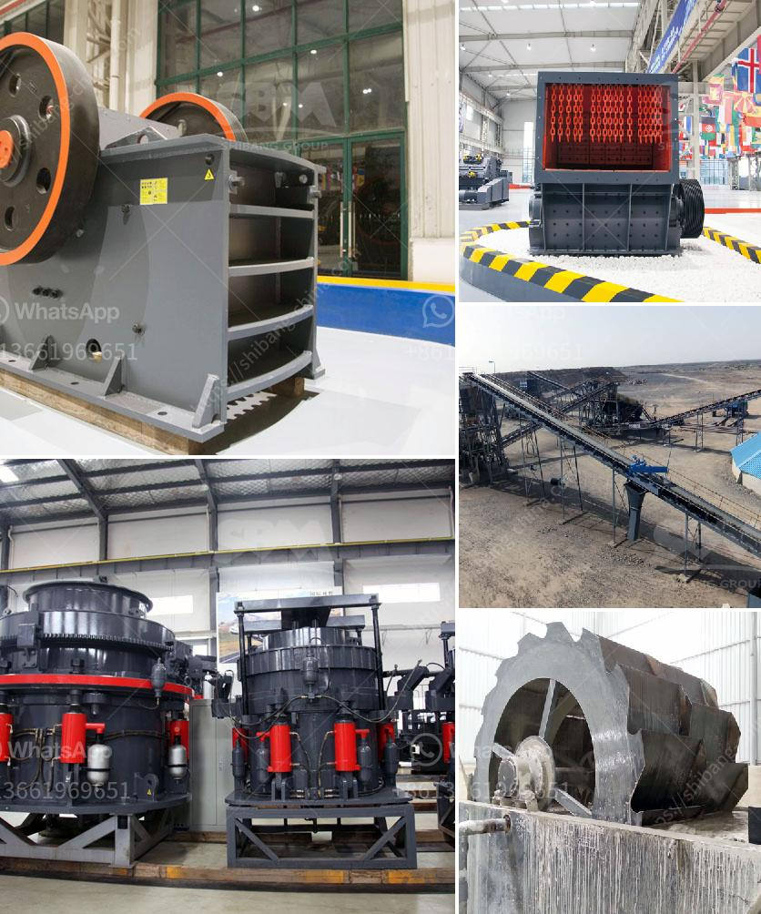

<h3>ورقة تدفق معالجة الحجر الجيري</h3>
معالجة الحجر الجيري هي عملية متعددة الخطوات يتم فيها تحويل الحجر الجيري الخام إلى منتج نهائي مفيد ومتنوع الاستخدامات. تستخدم هذه العملية في العديد من الصناعات مثل البناء والصناعات الكيماوية.

تبدأ عملية معالجة الحجر الجيري بتعدين الحجر الخام من المحاجر أو المناجم. يتم استخراج الحجر الجيري بواسطة آلات الحفر الثقيلة والتفكيك الأفقي. يجب أن يتم تحويل الحجر الجيري الخام إلى قطع صغيرة لسهولة تدفقه في المراحل اللاحقة من عملية المعالجة.

بعد استخراج الحجر الجيري الخام، يتم نقله إلى الكسارات حيث يتم سحقه وتفتيته إلى قطع صغيرة أكثر. يستخدم التكسير الأولي لهذا الغرض آلات الكسارة الفكية أو الكسارة الصدمية. إن التكسير الأولي يساعد في تحطيم الحجر الجيري إلى قطع مناسبة للمعالجة المرحلية التالية.

بعد عملية التكسير الأولي، يتم نقل الحجر الجيري المكسور إلى المراحل التالية للمعالجة. تشمل هذه المراحل الطحن والتصنيف والتركيب الكيميائي والمراقبة الجودة. يتم تحطيم الحجر الجيري المكسور أكثر هنا في مطحنة الكرة أو مطحنة الأسطوانة لتكوين مسحوق ناعم.

بعد عملية الطحن، يتم تصنيف المسحوق الناعم الناتج في أحجام مختلفة باستخدام الهزازات والمصافي. يتم استخدام الهزازات لفصل الحجر الجيري الناعم من التربة والشوائب الأخرى. يتم تجميع المسحوق النهائي الناعم في خزان خاص، في حين يتم التخلص من المواد الغير مرغوب فيها.

بعد عملية التصنيف، يتم إجراء تحليل كيميائي للمسحوق الناعم للتأكد من أن التركيب الكيميائي له يطابق المعايير المطلوبة. تتم عملية المراقبة الجودة كجزء من عملية المعالجة لضمان جودة المنتج النهائي.

بعد اجتياز مرحلة التحليل الكيميائي والمراقبة الجودة، يتم تعبئة المسحوق الناعم في حاويات جاهزة للنقل والتوزيع. يتم استخدام هذا المنتج النهائي في العديد من الصناعات ، مثل صناعة الزجاج والمواد الكيميائية وصناعة الأسمنت.

يمكن القول أن معالجة الحجر الجيري هي عملية معقدة ومتعددة الخطوات تتطلب التدفق الجيد للمواد الخام والمراقبة الصارمة للجودة. تؤدي هذه العملية إلى إنتاج منتج نهائي عالي الجودة ، وتساهم في الصناعات المختلفة وتلبي احتياجات السوق المتزايدة.
<h3>Contact us</h3><ul><li><strong>Whatsapp:&nbsp;<a href="https://wa.me/8613661969651">+8613661969651</a></strong></li><li><a href="https://swt.shibang-china.com/?git&amp;zhl&amp;ورقة تدفق معالجة الحجر الجيري"><strong>Online Service(chat now)</strong></a></li></ul><h3>Related</h3><ul><li><a href='مصنع الأسمنت في تركيا.md'>مصنع الأسمنت في تركيا</a></li><li><a href='مصنع تكسير خام الحديد في ألمانيا.md'>مصنع تكسير خام الحديد في ألمانيا</a></li><li><a href='آلات محجر كاملة للبيع في الصين.md'>آلات محجر كاملة للبيع في الصين</a></li><li><a href='معدات خط إنتاج كبريتات المغنيسيوم.md'>معدات خط إنتاج كبريتات المغنيسيوم</a></li><li><a href='سعر كسارة الفك 400x600.md'>سعر كسارة الفك 400x600</a></li></ul>