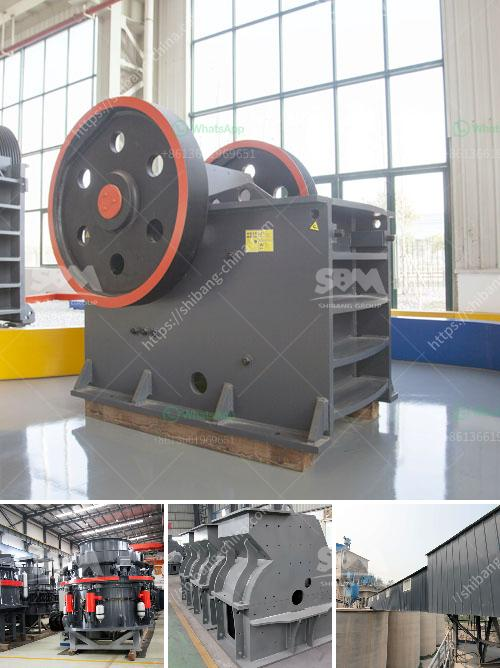

<h3>ورقة حساب حزام الناقل</h3>
يعد حزام الناقل واحدًا من الوسائل الرئيسية في عمليات النقل والتحميل في العديد من الصناعات. تستخدم ورقة حساب حزام الناقل لتحديد المعلومات الرئيسية التي تؤثر في عملية التصميم والتشغيل الفعال للحزام.

تحتوي ورقة حساب حزام الناقل على مجموعة متنوعة من البيانات والقيم التي يجب تحليلها وتقديرها قبل تصميم وتركيب الحزام الناقل. من أهم البيانات الموجودة فيها هي الحمولة المطلوب نقلها وسرعة النقل المطلوبة وطول الحزام وانتقال القوة المطلوبة وزاوية التفاف ونوعية وحالة المواد التي سيتم نقلها عبر الحزام.

باستخدام هذه البيانات، يمكننا استخدام ورقة حساب حزام الناقل لحساب المعلمات الأساسية لتصميم الحزام. تتضمن هذه المعلمات عرض الحزام، ومواصفات الأسطوانات، والتوتر المطلوب للحزام وزوايا التفاف اللازمة للحزام.

تساعد ورقة حساب حزام الناقل في تحسين كفاءة التصميم والتشغيل للحزام ووجود المعلومات الصحيحة فيها يسهم في تقليل التكاليف وتحسين أداء الحزام. فعلى سبيل المثال، يمكن استخدام البيانات الموجودة في الورقة لحساب الحمل الحزامي اللازم واختيار الحزام الملائم بناءً على البيانات المتاحة.

بالإضافة إلى ذلك، يساعد استخدام ورقة حساب حزام الناقل في تحديد حجم وسعة الحزام المطلوبة بدقة، مما يسهم في تحسين استخدام الحزام والحد من الهدر والخسائر الناجمة عن تصميم غير فعال للناقل.

باختصار، تعتبر ورقة حساب حزام الناقل أداة هامة لتصميم وتشغيل الحزام بشكل فعال. تساعد في توفير المعلومات الأساسية المطلوبة لتصميم الحزام وتحقيق الأداء الأمثل وتقليل التكاليف. لذلك، فإن استخدام ورقة حساب حزام الناقل يعد أمرًا ضروريًا لتحقيق تشغيل سلس وفعال للحزام في العديد من الصناعات.
<h3>Contact us</h3><ul><li><strong>Whatsapp:&nbsp;<a href="https://wa.me/8613661969651">+8613661969651</a></strong></li><li><a href="https://swt.shibang-china.com/?git&amp;zhl&amp;ورقة حساب حزام الناقل"><strong>Online Service(chat now)</strong></a></li></ul><h3>Related</h3><ul><li><a href='كسارة صخور محمولة صغيرة للسحق.md'>كسارة صخور محمولة صغيرة للسحق</a></li><li><a href='خط إنتاج مطحنة ريموند.md'>خط إنتاج مطحنة ريموند</a></li><li><a href='آلة كسارة الفك في المملكة العربية السعودية.md'>آلة كسارة الفك في المملكة العربية السعودية</a></li><li><a href='مصنع كسارة الصخور بسعة 150 طن.md'>مصنع كسارة الصخور بسعة 150 طن</a></li><li><a href='كسارة الحجر للبيع في بيرو.md'>كسارة الحجر للبيع في بيرو</a></li></ul>