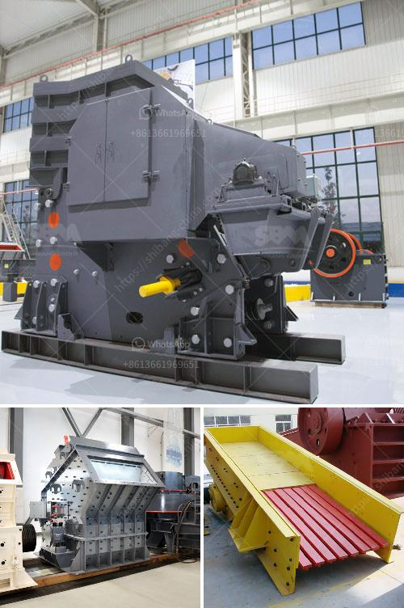

<h3>وزن آلة كسارة الصخور</h3>
تعد آلة كسارة الصخور أحد الأدوات الهامة في صناعة التعدين والبناء. تستخدم هذه الآلة لكسر الصخور الكبيرة إلى قطع صغيرة قابلة للاستخدام في العديد من التطبيقات المختلفة. واحدة من العوامل الرئيسية التي يجب أخذها في الاعتبار عند اختيار آلة كسارة الصخور هي وزنها.

يعتبر وزن آلة كسارة الصخور مهمًا لعدة أسباب. أولاً وقبل كل شيء ، يحدد الوزن عملية التركيب والتشغيل للكسارة. قد تكون الكسارة ذات الوزن الثقيل صعبة التنقل وتحتاج إلى جهود إضافية لتركيبها وتفكيكها ونقلها من موقع إلى آخر. ومع ذلك ، يمكن أن توفر التشغيل بمعايير الوزن العالي أداءًا أفضل ومتانة أكبر.

ثانيًا ، يؤثر الوزن على كفاءة كسارة الصخور. يجب أن يكون المحرك قويًا بما يكفي لتشغيل الكسارة وتحقيق أداء أمثل عندما يكون وزن الكسارة ثقيلاً. قد تتطلب الكسارات الأثقل قدرة أكبر واستهلاكًا أعلى للطاقة. ومع ذلك ، قد تكون قادرة على معالجة صخور أكبر وشديدة الصلابة بكفاءة عالية.

ثالثًا ، يتعلق وزن آلة كسارة الصخور بالسلامة. يتطلب التشغيل الآمن للكسارة اتخاذ احتياطات لتفادي الحوادث والإصابات. الكسارات الأثقل غالبًا ما تكون أكثر استقرارًا وتوفر قاعدة أفضل للعمل. هذا يعني أنها قد تكون أكثر أمانًا للاستخدام مقارنة بالكسارات الخفيفة.

وفي النهاية ، يجب أن يتم اختيار وزن آلة كسارة الصخور وفقًا لتطبيقها المحدد. يجب أن تكون قادرة على تناسب الظروف والنطاق الزمني لمشروعك. قد يكون الوزن الثقيل مطلوبًا لأعمال البناء الكبيرة وتكسير الصخور الكبيرة. ومع ذلك ، قد تكون الكسارات الخفيفة أكثر مناسبة للاستخدامات الأصغر حجمًا وأقل زمنًا.

في النهاية ، يعتبر وزن آلة كسارة الصخور أمرًا مهمًا يجب مراعاته عند اختيار الكسارة المناسبة. يجب أن يكون وزن الكسارة متوافقًا مع الفوائد والاحتياجات الفردية لكل مشروع. من خلال توازن الوزن والأداء ، يمكن تحقيق نتائج أفضل وتحقيق النجاح في عمليات التعدين والبناء.
<h3>Contact us</h3><ul><li><strong>Whatsapp:&nbsp;<a href="https://wa.me/8613661969651">+8613661969651</a></strong></li><li><a href="https://swt.shibang-china.com/?git&amp;zhl&amp;وزن آلة كسارة الصخور"><strong>Online Service(chat now)</strong></a></li></ul><h3>Related</h3><ul><li><a href='مطاحن الكرة حديد الصهر الهند.md'>مطاحن الكرة حديد الصهر الهند</a></li><li><a href='كيفية حساب تكلفة الطحن.md'>كيفية حساب تكلفة الطحن</a></li><li><a href='معدات طحن فائقة الدقة.md'>معدات طحن فائقة الدقة</a></li><li><a href='كسارة مخروطية في الشرق الأوسط.md'>كسارة مخروطية في الشرق الأوسط</a></li><li><a href='آلة كسارة في الفلبين.md'>آلة كسارة في الفلبين</a></li></ul>