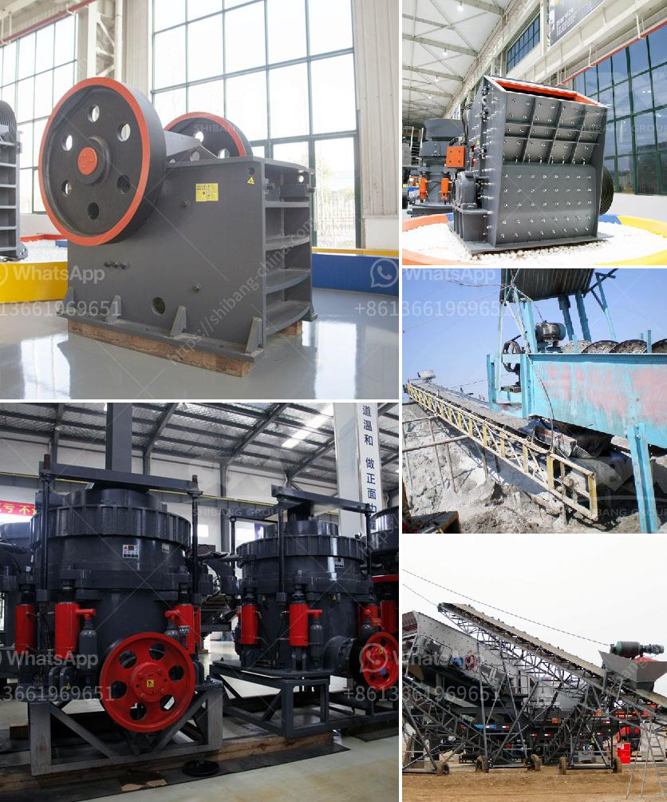

<h3>وزن كسارة الحجر</h3>
تعتبر كسارة الحجر من الأدوات الهامة في صناعة البناء والتشييد، حيث يتم استخدامها لسحق الحجارة الكبيرة للحصول على حجم صغير يمكن استخدامه في البناء والأعمال الإنشائية المختلفة. يعتبر وزن كسارة الحجر من العوامل المهمة التي يجب النظر فيها عند شراء أو استئجار هذا النوع من الأدوات، وذلك لأن الوزن يؤثر في القوة والكفاءة وأداء الكسارة.

يتراوح وزن كسارة الحجر عادة بين 50 إلى 150 طنًا، ولكن يمكن أن يزيد أو يقل هذا الوزن اعتمادًا على حجم الكسارة وإمكانياتها. تعتبر الكسارات الصغيرة التي تستخدم في المشاريع الصغيرة والمنازل والحدائق والورش البناء من فئة الكسارات ذات الأوزان الأخف والتي تتراوح من 50 إلى 80 طنًا. وتكون هذه الكسارات عادة محمولة ويمكن نقلها بسهولة من مكان إلى آخر.

بالمقابل، تعتبر الكسارات الكبيرة التي تستخدم في المشاريع الضخمة والمناجم والمحاجر من فئة الكسارات ذات الأوزان الأثقل والتي تتراوح من 100 إلى 150 طنًا أو أكثر. وتكون هذه الكسارات غالبًا ثابتة وتحتاج إلى تركيب صلب وتحمل الأحمال الثقيلة.

من المهم أن تكون وحدة وزن كسارة الحجر متوافقة مع العمل الذي ستستخدم فيه. فإذا كانت الكسارة ستستخدم في موقع ضخم مثل منجم أو محجر، فيجب أن تكون لديها وحدة وزن كبيرة بحيث يمكنها تحمل الأحمال الثقيلة والعمل لساعات طويلة دون أي مشاكل. وعلى العكس من ذلك، فإن الكسارات الصغيرة التي تستخدم في المشروعات الصغيرة يجب أن تكون أخف وزنًا وأكثر قابلية للنقل.

بالإضافة إلى ذلك، يجب أن يؤخذ في الاعتبار أن الوزن يؤثر في تكاليف النقل والتركيب والاستخدام. فكلما زاد وزن الكسارة، زادت تكاليف نقلها وتركيبها، واحتاجت إلى معدات خاصة للنقل والتحميل. بالإضافة إلى ذلك، يجب أيضًا أن يتم احتساب تكاليف استخدام الكسارة مع الوزن المحدد، حيث يجب أن يكون لديك الهياكل والمواد القوية لتحمل الوزن وتضمن الأداء العالي والأمان.

باختصار، وزن كسارة الحجر هو عامل هام يجب مراعاته عند اختيار هذه الأداة الهامة في صناعة البناء والتشييد. يجب أن يتناسب الوزن مع الاستخدام المطلوب وتكاليف النقل والتركيب والاستخدام. وبالاختيار الصحيح لوحدة الوزن، يمكنك الاستفادة الكاملة من أداء الكسارة وتحقيق النتائج المرجوة في مشاريعك.
<h3>Contact us</h3><ul><li><strong>Whatsapp:&nbsp;<a href="https://wa.me/8613661969651">+8613661969651</a></strong></li><li><a href="https://swt.shibang-china.com/?git&amp;zhl&amp;وزن كسارة الحجر"><strong>Online Service(chat now)</strong></a></li></ul><h3>Related</h3><ul><li><a href='مقترح مشروع حول مصنع تكسير الحجر.md'>مقترح مشروع حول مصنع تكسير الحجر</a></li><li><a href='أسعار آلات كسارة الأسمنت في الهند.md'>أسعار آلات كسارة الأسمنت في الهند</a></li><li><a href='مطحنة طحن عمودية.md'>مطحنة طحن عمودية</a></li><li><a href='وزن آلة كسارة الصخور.md'>وزن آلة كسارة الصخور</a></li><li><a href='كسارة صخور محمولة صغيرة للسحق.md'>كسارة صخور محمولة صغيرة للسحق</a></li></ul>