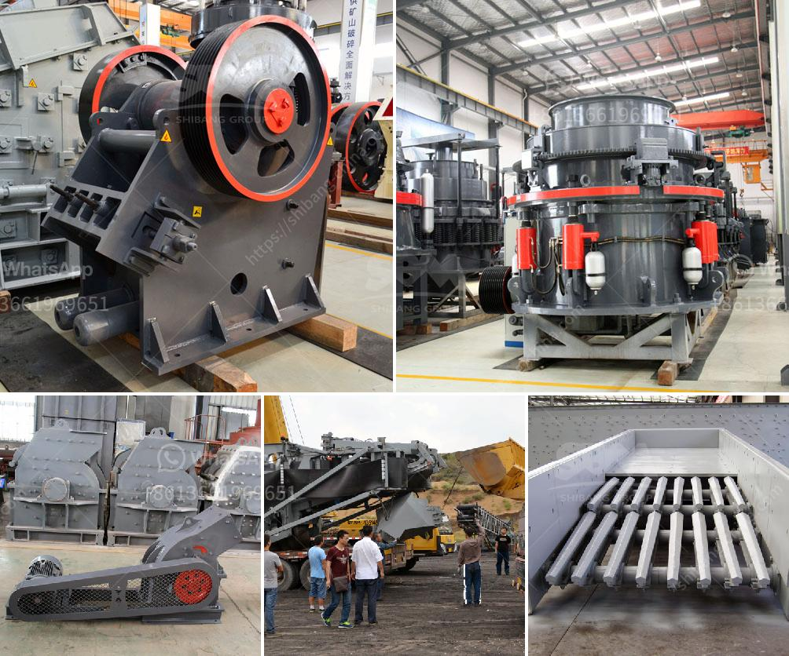

<h3>وزير التعدين في غانا</h3>
تعتبر صناعة التعدين من أهم القطاعات الاقتصادية في غانا، حيث تساهم بشكل كبير في الناتج المحلي الإجمالي وتوفير فرص العمل. ومن أجل تنظيم وتطوير هذه الصناعة الحيوية، تم تعيين وزير التعدين كمسؤول رئيسي للقطاع.

تواجه صناعة التعدين في غانا العديد من التحديات، ومن أبرزها مشكلة التنظيم والإشراف على العمليات التعدينية. فقد كانت هناك حالات عديدة للاستغلال غير المشروع للموارد المعدنية والانتهاكات البيئية في العقود الماضية. لذا، فإن وزير التعدين يلعب دورًا حاسمًا في تعزيز الإصلاحات وتحسين التشريعات واللوائح المتعلقة بالتعدين.

من أهم الإنجازات التي حققها وزير التعدين في غانا هو إجراء تحسينات جوهرية في قطاع التنقيب وتطوير الموارد المعدنية. تم وضع إطار قانوني واضح للتعدين، وتطوير سياسات وإجراءات تسهم في تنظيم القطاع وحماية المستثمرين والعاملين فيه. كما تم تقديم تسهيلات وتحفيزات لجعل غانا مقصدًا مثاليًا للاستثمار في قطاع التعدين.

وفي إطار تعزيز شفافية القطاع، تم إنشاء هيئة المعادن في غانا لتنظيم وإدارة الموارد المعدنية. كما تم تطوير نظام إلكتروني لتتبع ورصد عمليات التنقيب وتشغيل الشركات في القطاع، مما يساهم في الحد من الاستغلال غير المشروع وضمان استدامة الموارد.

بالإضافة إلى ذلك، قام وزير التعدين بتعزيز التعاون بين القطاع العام والخاص في قطاع التعدين. تم تشجيع الشركات المعدنية الكبرى والصغيرة والمتوسطة على الاستثمار في غانا وتطوير المشاريع بشكل أكثر استدامة وفاعلية. كما تم تعزيز ورش العمل والمؤتمرات والمعارض لتشجيع التعاون وتبادل المعرفة والتقنيات الحديثة في مجال التعدين.

على الرغم من هذه الإنجازات، فإن وزير التعدين لم يواجه سوى الكثير من التحديات، ومن أبرزها ضعف البنية التحتية والتكنولوجيا في القطاع التعديني. على الرغم من أن الحكومة قد خططت للتحسينات في هذا الصدد، إلا أنه من الضروري العمل على تطبيق تلك الخطط وتنفيذها بفعالية.

وفي الختام، فإن وزير التعدين في غانا يعد شخصية مهمة وحاسمة في تنمية القطاع التعديني وتحقيق الاستدامة والنمو الاقتصادي. هو مسؤول عن تعزيز الشفافية وتحسين اللوائح والسياسات المتعلقة بالتعدين. باستفادة من الإنجازات التي حققها واجهة التحديات المتبقية، يمكن تعزيز دور صناعة التعدين في غانا وتحقيق المزيد من النجاحات في المستقبل.
<h3>Contact us</h3><ul><li><strong>Whatsapp:&nbsp;<a href="https://wa.me/8613661969651">+8613661969651</a></strong></li><li><a href="https://swt.shibang-china.com/?git&amp;zhl&amp;وزير التعدين في غانا"><strong>Online Service(chat now)</strong></a></li></ul><h3>Related</h3><ul><li><a href='أسعار وحدات طحن الكلنكر.md'>أسعار وحدات طحن الكلنكر</a></li><li><a href='كسارة لقاعدة الطريق الزرقاء.md'>كسارة لقاعدة الطريق الزرقاء</a></li><li><a href='دراسة الجدوى حول حجر الأبعاد في إثيوبيا.md'>دراسة الجدوى حول حجر الأبعاد في إثيوبيا</a></li><li><a href='معدات طحن رفيعة جداً رطبة.md'>معدات طحن رفيعة جداً رطبة</a></li><li><a href='محطات غسيل الذهب المحمولة.md'>محطات غسيل الذهب المحمولة</a></li></ul>