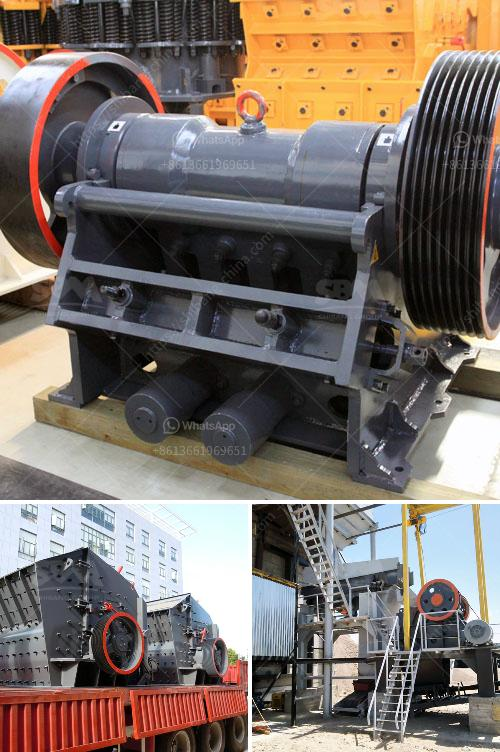

<h3>وظائف كسارة مخروطية</h3>
تعتبر الكسارات المخروطية أحد أنواع معدات التكسير الهامة في صناعة التعدين والبناء. تستخدم هذه الكسارات لتكسير الصخور والمواد الصلبة الأخرى إلى قطع صغيرة ومناسبة للاستخدام في العديد من التطبيقات المختلفة. في هذه المقالة سنستعرض أهم الوظائف التي تقوم بها الكسارة المخروطية وأهميتها في الصناعة.

أولاً، تستخدم الكسارة المخروطية لتكسير الصخور الصلبة المختلفة. يتم ذلك عن طريق وضع الصخور داخل الكسارة وتسحق بين الجدران الثابتة والجزء المتحرك الداخلي للكسارة. تعد الكسارة المخروطية قادرة على تكسير الصخور بمختلف الأحجام ومنحنيات القوة، وتتميز بقدرتها على تكسير الصخور ذات القوة العالية وتلك ذات الشكل الغريب.

ثانياً، تستخدم الكسارة المخروطية لإنتاج الركام، والذي يستخدم في البناء والأعمال الإنشائية. يتم تكسير الصخور لتصبح قطع صغيرة من الحجم المناسب للاستخدام في مواد البناء مثل الخرسانة والأسفلت والحصى. وبالتالي، يمكن للكسارة المخروطية أن تلعب دورًا حاسمًا في إعادة التدوير والاستفادة من المواد الصلبة المكسورة.

ثالثاً، تستخدم الكسارة المخروطية في صناعة المعادن. فعند تكسير خام المعادن، يتم استخدام الكسارات المخروطية لتحويل الصخور الضخمة إلى جزيئات صغيرة مناسبة لعمليات النقل والمعالجة اللاحقة. يعد تثبيت الكسارات المخروطية داخل محجر المعادن من الأمور الأساسية لضمان استخلاص المواد القيمة.

رابعاً، تستخدم الكسارة المخروطية في صناعة البناء والأعمال العامة. وتعد هذه الكسارات أحد المعدات الأساسية في المشاريع الكبيرة مثل الطرق والجسور والنفق وأنظمة الصرف الصحي. حيث أنها تتيح تكسير الصخور واستخدامها في تعبيد الطرق والرصف، وتخريص المواد الصلبة اختيارياً للاستخدام في مشاريع أخرى.

باختصار، تعد الكسارة المخروطية جزءًا هامًا من صناعة التعدين والبناء. حيث تستخدم لتكسير الصخور وإنتاج الركام، وفي صناعة المعادن والبناء بشكل عام. تلعب دورًا حاسمًا في تحويل الصخور الكبيرة إلى جزيئات صغيرة مناسبة للاستخدام وتوفير الموارد الطبيعية. وبالتالي، تعتبر الكسارة المخروطية أداة أساسية لتحقيق التنمية المستدامة في صناعة التعدين والبناء.
<h3>Contact us</h3><ul><li><strong>Whatsapp:&nbsp;<a href="https://wa.me/8613661969651">+8613661969651</a></strong></li><li><a href="https://swt.shibang-china.com/?git&amp;zhl&amp;وظائف كسارة مخروطية"><strong>Online Service(chat now)</strong></a></li></ul><h3>Related</h3><ul><li><a href='عملية تصنيع الحجر.md'>عملية تصنيع الحجر</a></li><li><a href='مصنع غسيل الذهب بسعة ١٠٠ طن في الساعة.md'>مصنع غسيل الذهب بسعة ١٠٠ طن في الساعة</a></li><li><a href='مطحنة صغيرة.md'>مطحنة صغيرة</a></li><li><a href='مطحنة الكرة للجبس.md'>مطحنة الكرة للجبس</a></li><li><a href='آلات تصنيع الرمل في الصين.md'>آلات تصنيع الرمل في الصين</a></li></ul>