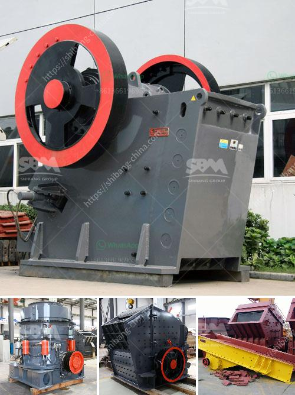

<h3>وكيل كسارة الفحم في إندونيسيا</h3>
تعتبر إندونيسيا واحدة من أكبر دول المنتجة للفحم في العالم، حيث توجد فيها كميات هائلة من الفحم تحت الأرض. ومن أجل استخراج هذا الثروة، يتم استخدام وكلاء كسارة الفحم.

وكيل كسارة الفحم هو الشخص المسؤول عن تحويل الفحم الموجود تحت الأرض إلى قطع صغيرة تُستخدم في توليد الطاقة الكهربائية وتصنيع المعادن والمواد الكيميائية الأخرى. يتم ذلك عن طريق استخدام آلة كسارة تقوم بسحق الفحم إلى قطع صغيرة ومن ثم إرسالها عبر ناقلات إلى العربات النقل أو السفن.

تعتبر عملية كسارة الفحم مهمة للغاية لأنها تسهم في استغلال هذه الثروة الطبيعية واستخدامها بطريقة فعالة ومستدامة. ومن خلال عمل وكيل كسارة الفحم، يتم زيادة إنتاجية مناجم الفحم وتوفير المزيد من فرص العمل للسكان المحليين.

يجب على وكيل كسارة الفحم أن يكون على دراية تامة بطرق استخراج الفحم وعمليات المعالجة المختلفة. يجب عليه أيضًا الحرص على سلامة العمال والمعدات المستخدمة في العملية، حيث يتطلب العمل بالقرب من آلة الكسارة اتخاذ تدابير أمان صارمة.

علاوة على ذلك، يجب أن يتعامل وكيل كسارة الفحم بحساسية مع البيئة المحيطة، حيث يترتب على عملية استخراج الفحم تأثيرات سلبية على البيئة المحيطة بسبب تراكم الغبار والانبعاثات الضارة. لذا، يتوجب على الوكيل اتباع أفضل الممارسات البيئية للحد من تأثيرات العمل على البيئة.

في الختام، يعد وكيل كسارة الفحم في إندونيسيا شخصًا حيويًا في صناعة الفحم. يساهم في استغلال هذه الثروة الضخمة بطريقة فعالة ومستدامة، كما يساهم في توفير فرص العمل وتقدم المجتمعات المحلية. ومع اعتبار العوامل البيئية والأمان، يصبح دور وكيل كسارة الفحم أكثر أهمية في ضمان استمرارية هذه الصناعة.
<h3>Contact us</h3><ul><li><strong>Whatsapp:&nbsp;<a href="https://wa.me/8613661969651">+8613661969651</a></strong></li><li><a href="https://swt.shibang-china.com/?git&amp;zhl&amp;وكيل كسارة الفحم في إندونيسيا"><strong>Online Service(chat now)</strong></a></li></ul><h3>Related</h3><ul><li><a href='سعر معدات الطحن 250 طن.md'>سعر معدات الطحن 250 طن</a></li><li><a href='كسارة حجر الجرانيت المحمولة.md'>كسارة حجر الجرانيت المحمولة</a></li><li><a href='كسارة صخور محمولة صغيرة للسحق.md'>كسارة صخور محمولة صغيرة للسحق</a></li><li><a href='مطاحن الكرة الأرجنتينية.md'>مطاحن الكرة الأرجنتينية</a></li><li><a href='مصنع معالجة ملح الصخور.md'>مصنع معالجة ملح الصخور</a></li></ul>