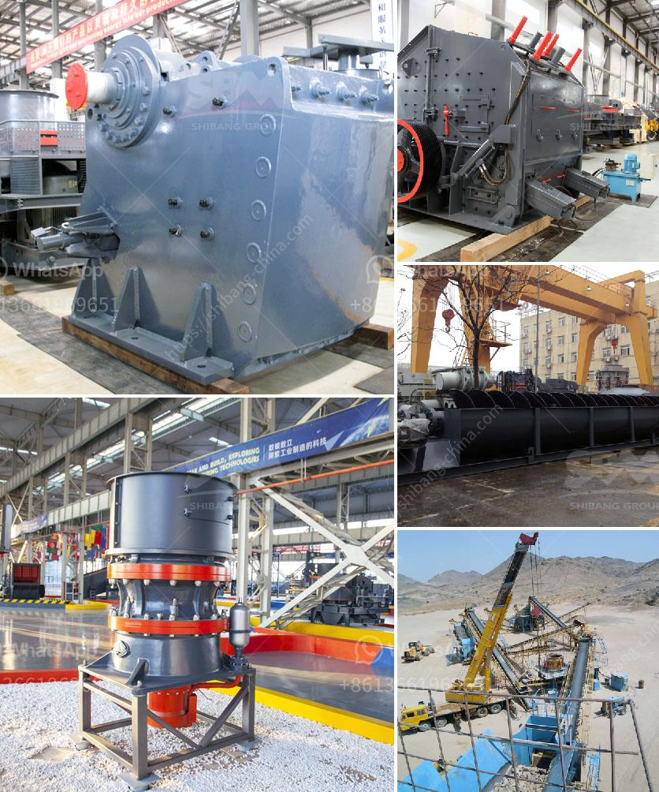

<h3>وكيل كسارة الفك في كينيا</h3>
تعتبر صناعة البناء والتشييد من القطاعات الحيوية في كينيا، وتشهد نموًا مستمرًا في السنوات الأخيرة. ولا يمكن تجاهل الدور الذي يلعبه جهاز كسارة الفك في عمليات التكسير والتكسير الأولية للصخور والمواد الخام المستخدمة في صناعة البناء والبنية التحتية. إن وكيل كسارة الفك في كينيا يلعب دورًا هامًا في تلبية احتياجات هذه الصناعة المتزايدة.

تقوم وكالة كسارة الفك بتوريد وتسويق الكسارات ومعدات التكسير المختلفة في كينيا. تعد الكسارة الفك واحدة من أهم المعدات المستخدمة في صناعة التكسير، حيث تقوم بتكسير الصخور والحجارة الكبيرة إلى أحجام أصغر وأكثر ملاءمة للاستخدام في مشاريع البناء المختلفة. تعتبر الكسارة الفك آلة تقوم بتحويل المواد من الحالة الصلبة إلى الحالة الرملية أو الجزئية، وهي تستخدم بشكل شائع في تكسير الحجارة والصخور الصلبة.

تعتبر وكيل كسارة الفك في كينيا موردًا رئيسيًا للعديد من الشركات في صناعة البناء والتشييد، حيث توفر المعدات اللازمة لهذه الشركات. تتيح الكسارة الفك العديد من المزايا للعملاء، مثل سهولة الاستخدام والصيانة والتشغيل الآمن. كما أنها تعمل بكفاءة عالية وتقدم أداءً ممتازًا في عمليات التكسير. بالإضافة إلى ذلك، يقدم وكيل الكسارة الفك خدمات ما بعد البيع الممتازة، بما في ذلك التدريب والصيانة وتصليح العطل.

يعتبر وكيل كسارة الفك في كينيا جزءًا من قطاع البناء الذي يساهم في النمو الاقتصادي وتوفير فرص العمل في البلاد. وتزداد الحاجة إلى مشاريع البناء والبنية التحتية في كينيا، مما يدفع الشركات لاستثمار في معدات التكسير المتطورة والفعالة. بوجود وكيل كسارة الفك المحلي، فإن العملاء في كينيا يمكنهم الاعتماد على الحصول على المعدات والدعم الفني المطلوب لتلبية احتياجاتهم في مجال التكسير.

باختصار، يلعب وكيل كسارة الفك في كينيا دورًا حيويًا في صناعة البناء والتشييد في البلاد. فهو يوفر الكسارات والمعدات اللازمة لعمليات التكسير والتكسير الأولية. كما يقدم خدمات ما بعد البيع الممتازة للعملاء لضمان أن المعدات تعمل بأقصى كفاءة. تساهم هذه الجهود في تعزيز قدرة البناء في كينيا وتوفير فرص العمل.
<h3>Contact us</h3><ul><li><strong>Whatsapp:&nbsp;<a href="https://wa.me/8613661969651">+8613661969651</a></strong></li><li><a href="https://swt.shibang-china.com/?git&amp;zhl&amp;وكيل كسارة الفك في كينيا"><strong>Online Service(chat now)</strong></a></li></ul><h3>Related</h3><ul><li><a href='مطحنة كرات صغيرة للبيع.md'>مطحنة كرات صغيرة للبيع</a></li><li><a href='مطحنة طحن الحجر من ألمانيا.md'>مطحنة طحن الحجر من ألمانيا</a></li><li><a href='كسارات مصنوعة في الفلبين الجنوبية.md'>كسارات مصنوعة في الفلبين الجنوبية</a></li><li><a href='مطحنة الكرة في كازاخستان.md'>مطحنة الكرة في كازاخستان</a></li><li><a href='آلات محجر الجرانيت للبيع.md'>آلات محجر الجرانيت للبيع</a></li></ul>